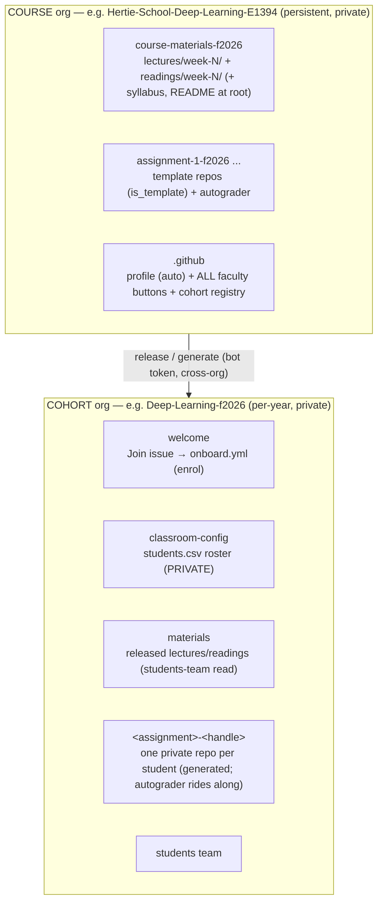

# DSL Teaching & Course Setup

Central registry of the workflows that deliver courses at the Hertie Data Science Lab.
Everything faculty-facing is a **GitHub Actions button**; the Python in `dsl_course/` is the
single implementation behind every button.

## The model

Two org tiers:
1. the **course** org is the faculty-facing source of truth - the historical registry of
   course materials, persistent across years, where faculty push version-controlled materials
   from;
2. the **cohort** org is the per-year student-facing target - materials are released here,
   student assignments are submitted here, and student-facing features (onboarding, the
   website) live here.

Each cohort gets an auto-deployed `<cohort>.github.io` site whose material links are private
(enrolled students only). Optionally, a course can also publish a **public**
`<course-org>.github.io` open-courseware site that shares its lectures + readings with the
world (see [Optional: public course website](#optional-public-course-website)).

## The faculty journey

Standing up and running a course is three phases - every step is a GitHub Actions button:

1. **[Set up the course](#1-set-up-the-course-once)** - once, when the course first exists.
2. **[Add a cohort](#2-add-a-cohort-each-year)** - once per year.
3. **[Run the course](#3-run-the-course-each-week)** - the weekly release loop.

> **What you need to provide:** [`docs/REQUIRED-INPUT-SCHEMA.md`](docs/REQUIRED-INPUT-SCHEMA.md)
> is the authoritative checklist of every input (config, materials, assignments, roster) and
> the one canonical place each one lives. Keep it open alongside the steps below.
>
> **Worked example:** [`example-course/`](example-course/README.md) is a ready-to-deploy dummy
> course you can stand up end to end on `Hertie-DSL-Demo` / `DSL-Demo-f2026`.

## 1. Set up the course (once)

_Steps 1.1-1.2 are manual (GitHub has no org-creation API); the rest are buttons._

### 1.1 Create the empty course org
  - Create the org at https://github.com/account/organizations/new (Free plan). Creating the
    org in the web UI is the one manual step - GitHub has no org-creation API.

### 1.2 Add the DSL bot as an owner
  - Org **People** tab `https://github.com/orgs/<ORG>/people` → **Invite member** →
    **`hertie-dsl-bot`** → role **Owner**. The bot accepts the invite once (GitHub requires the
    invitee to accept - there's no API to force-add a member).
  - (Which account is "the DSL bot"? See [The bot account](docs/ADMIN-SETUP.md#the-bot-account).)

### 1.3 Bootstrap the org
  - On _this_ repo's Actions tab → [**Bootstrap Course Org**](https://github.com/hertie-data-science-lab/dsl-teaching-course-setup/actions/workflows/bootstrap-org.yml)
    (`org` = the new org; optionally `admin` = the course admin's GitHub handle(s)).
  - This sets teams, 2FA, the `.github` profile, all the faculty buttons, grants the
    `instructors`/`course-admin` teams access to run them, and propagates `DSL_BOT_TOKEN`.
  - Add this course's instructors/TAs to the **`instructors`** team (write) via the org's Teams
    page; only the people who run this course - they then see the buttons in the Actions tab.

### 1.4 Add content repos
  - Use the bootstrapped **New materials repo** & **New assignment** buttons - these scaffold
    the exact directory structure the **Release materials** / **Release assignment** workflows
    expect.
  - **Materials:** a `course-materials-f202x` repo with a `lectures/week-N/` folder, a
    `readings/week-N/` folder, and optionally a syllabus + README at the root.
  - **Assignments:** one `assignment-N-f202x` template repo per assignment - mark `is_template`,
    add the starter materials, optionally an autograder and a `solution` branch.
  - Full per-input detail (what's mandatory, what's synthesised):
    [`docs/REQUIRED-INPUT-SCHEMA.md` → Course org content](docs/REQUIRED-INPUT-SCHEMA.md#b-course-org-content-persistent).

### 1.5 Refresh the course org
  - In the bootstrapped course org, run the **Refresh actions** button. The content repos get
    their run-from-repo Release buttons, the repo secret is propagated, and every dropdown
    populates from live state.
  - _Alternatively, this repo's [`Refresh Course Org Inventory`](https://github.com/hertie-data-science-lab/dsl-teaching-course-setup/actions/workflows/refresh-inventory.yml)
    refreshes actions across all DSL-managed repos at once._

## 2. Add a cohort (each year)

A cohort is bootstrapped by the **same** mechanism as a course - it's `Bootstrap Course Org`
with the **`cohort`** box ticked (plus the parent `course` org).

### 2.1-2.2 Create the empty cohort org + add the bot as Owner
  - Identical to course steps 1.1-1.2 (create at https://github.com/account/organizations/new,
    Free plan; invite the bot as **Owner**).

### 2.3 Bootstrap it as a cohort
  - Run `Bootstrap Course Org` with **`cohort`** ticked and `course` = the parent course org
    (exposed in the course org as the **`Bootstrap cohort`** button, which is that same action
    pre-set for cohorts).
  - On top of the course bootstrap, the `cohort` flag additionally seeds the `welcome`
    (onboard) + `classroom-config` (roster) repos, tightens permissions, scaffolds the website,
    and **registers** the cohort in `.github/cohort-courses-pages.yml` (refreshing every
    dropdown so it appears everywhere).
  - Replace the starter row in `classroom-config/students.csv` with registrar data
    (`student_id, hertie_email, name, section`; handles fill in as students onboard).

## 3. Run the course (each week)

The recurring loop, run from the course org's `.github` Actions tab (**Release materials** and
**Release assignment** also live inside each content / assignment-template repo, where `week`
is a dropdown of that repo's weeks):

- **Release materials** (pick cohort + week) → that week's `lectures/week-N/` + `readings/week-N/`
  folders appear in the cohort `materials` repo (private, `students` read) and on the site.
  Repeat weekly - "each week opens up".
- **Release assignment** (pick cohort + assignment) → freezes a cohort-level template, then
  generates one private `<assignment>-<handle>` repo per onboarded student.
- Students **onboard themselves**: they open a **Join** issue in the public `welcome` repo and
  type their student ID; `onboard.yml` matches it against the private roster, records their
  authenticated handle + GitHub id, and grants org + `students`-team access. The **Enroll
  student** button is the faculty override.

## All faculty actions (reference)

All live in the course org's bootstrapped **`.github`** Actions tab.

### One-time setup actions

| Action | Where | Effect |
| --- | --- | --- |
| **Bootstrap cohort** | `.github` | Configure a pre-created cohort org (welcome + roster + tighten + website), register it, refresh. |
| **Enroll student** | `.github` | Grant a handle org + `students`-team access (faculty override for the Join issue). Blank handle = reconcile the whole roster. |
| **New materials repo** | `.github` | Scaffold a structured `course-materials-<year>` repo (week folders + Release buttons). |
| **New assignment** | `.github` | Scaffold an `assignment-N-<year>` template (starter + autograder on `main`, an empty `solution` branch). |
| **Refresh actions** | `.github` | Re-seed the run-from-repo buttons into every content repo, propagate the repo secret, repopulate all dropdowns, rebuild the profile READMEs. |

### Weekly cadence actions

| Action | Where | Effect |
| --- | --- | --- |
| **Release materials** | `.github` (pick source repo, type week) **or** the materials repo (week dropdown) | Copies the *whole* `lectures/week-N/` + `readings/week-N/` folders - every file - into the cohort `materials` repo (private + `students` read), nested under `week-N/`. Only released weeks appear. Optional `syllabus` / `README` toggles (default off). |
| **Release assignment** | `.github` or the materials repo | Two stages: freeze a cohort-level template repo `<slug>` from the chosen `assignment-*` template, then generate one private `<slug>-<handle>` repo per onboarded student *from that cohort template* (+ collaborator). `include_solution` pushes the template's `solution` branch into each student repo. |
| **Sync site** | `.github` | Regenerate a cohort's website from the org structure - releases do this automatically; the standard workflow has no need for manual sync. |

## Optional: public course website

| Action | Where | Effect |
| --- | --- | --- |
| **Publish course website** | `.github` | Build/refresh a **public** `<course-org>.github.io` site sharing this course's lectures + readings. Opt-in + manual (first run scaffolds it). Pick a materials repo; choose readings as `reading-list` (citations only) or `actual-readings` (also host the files). Because the materials repos are private, the site **hosts** the shared files itself. Separate from the per-cohort student-gated sites; releases/refresh never touch it. |

## Access - who can run what

Access is by **team membership → repo write**, and splits into two separate populations: a
course org's own **`instructors`/`course-admin`** teams may run **that course's** buttons
(bootstrap grants them write/admin on `.github`), while the central **`faculty`/`admin`** teams
in `hertie-data-science-lab` may run **Bootstrap Course Org** (provision any org) - nobody is
added to a course they don't teach. Either way they never hold the token. Full detail:
[`docs/ADMIN-SETUP.md`](docs/ADMIN-SETUP.md#who-can-run-which-action).

## Admin & developer reference

Faculty delivering a course don't need these:

- **[`docs/ARCHITECTURE.md`](docs/ARCHITECTURE.md)** - how the system is built and how the
  pieces move: system + token-propagation + access diagrams, workflow sequences, the bot
  lifecycle, and the code map.
- **[`docs/ADMIN-SETUP.md`](docs/ADMIN-SETUP.md)** - operational reference: the bot credential
  + exact PAT scopes, the token / secret model, and who-can-run access.
