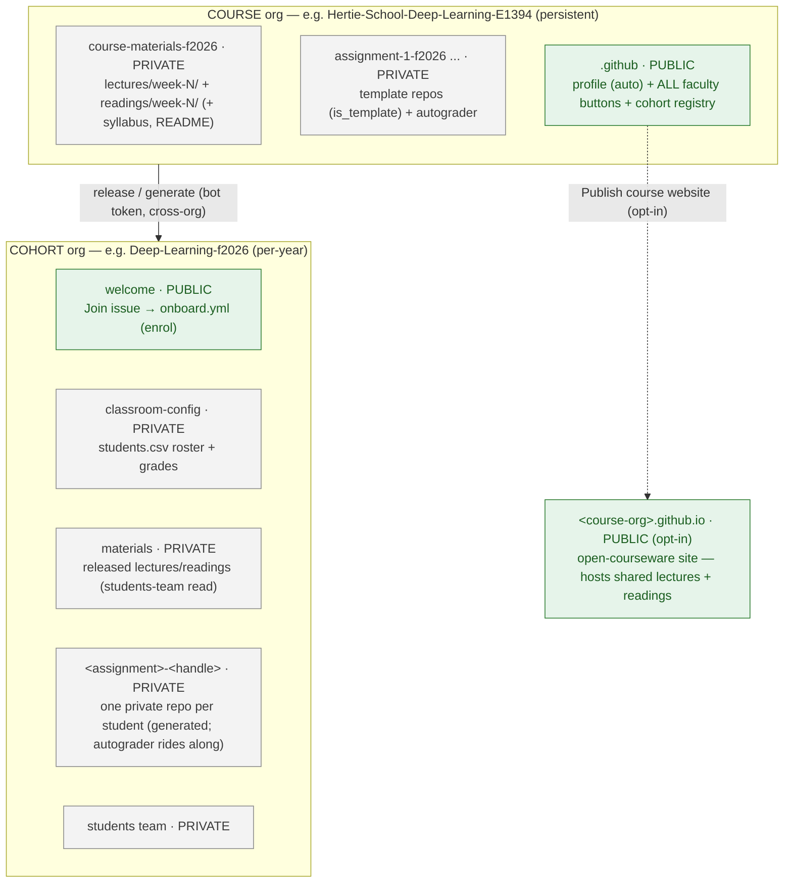

# DSL Teaching & Course Setup

Central registry of the workflows that deliver courses at the Hertie Data Science Lab.
Everything faculty-facing is a **GitHub Actions button**; the Python in `dsl_course/` is the
single implementation behind every button.

## The model

Two org tiers:
1. the **course** org is the faculty-facing control plane - the historical registry of
   course materials, persistent across years, where faculty push version-controlled materials
   from;
2. the **cohort** org is the per-year student-facing delivery target - materials are released
   here, student assignments are submitted and assessed here, and student-facing features
   (onboarding, the website) live here.

Each cohort gets an auto-deployed `<cohort>.github.io` site whose material links are private
(enrolled students only). Optionally, a course can also publish a **public**
`<course-org>.github.io` open-courseware site that shares its lectures + readings with the
world (see [Optional: public course website](#optional-public-course-website)).

## Deploying a course

Deployment is three phases - **set up the course** (once), **add a cohort** (per year), then
**run the course** (release weekly). Every step is one of the buttons in the
[Faculty actions](#faculty-actions-reference) reference below.

> **Follow the [deployment checklist](docs/REQUIRED-INPUT-SCHEMA.md#deployment-checklist)** -
> the canonical, tickable, deploy-ordered sequence, naming the exact place each input lives.
> [`docs/REQUIRED-INPUT-SCHEMA.md`](docs/REQUIRED-INPUT-SCHEMA.md) is the full input reference
> behind it.
>
> **Worked example:** [`example-course/`](example-course/README.md) is a ready-to-deploy dummy
> course you can stand up end to end on `Hertie-DSL-Demo` / `DSL-Demo-f2026`.

The only manual steps are creating each org in the GitHub web UI (there is no org-creation
API) and inviting **`hertie-dsl-bot`** as **Owner** ([which account?](docs/ADMIN-SETUP.md#the-bot-account)) -
everything after that is a button. Provisioning an org is done by
[**Bootstrap Course Org**](https://github.com/hertie-data-science-lab/dsl-teaching-course-setup/actions/workflows/bootstrap-org.yml)
in *this* repo's Actions tab; it sets teams, 2FA, the `.github` profile, all the buttons
below, the team grants, and propagates `DSL_BOT_TOKEN`.

## Faculty actions (reference)

What each button does. All live in the course org's bootstrapped **`.github`** Actions tab;
**Release materials** and **Release assignment** *also* live inside each content /
assignment-template repo ("run-from-repo"), where `week` is a dropdown of that repo's weeks.

### One-time setup actions

| Action | Where | Effect |
| --- | --- | --- |
| **Bootstrap cohort** | `.github` | Configure a pre-created cohort org (welcome + roster + tighten + website), register it, refresh. |
| **Sync enrolment** | `.github` | Reconcile org + `students`-team access from `students.csv` (students self-onboard via the Join issue; faculty run this to true-up). `prune` off-boards members no longer on the roster. |
| **New materials repo** | `.github` | Scaffold a structured `course-materials-<year>` repo (week folders + Release buttons). |
| **New assignment** | `.github` | Scaffold an `assignment-N-<year>` template (starter + autograder on `main`, an empty `solution` branch). |
| **Refresh actions** | `.github` | Re-seed the run-from-repo buttons into every content repo, propagate the repo secret, repopulate all dropdowns, rebuild the profile READMEs. _(Across all DSL-managed repos at once: [`Refresh Course Org Inventory`](https://github.com/hertie-data-science-lab/dsl-teaching-course-setup/actions/workflows/refresh-inventory.yml) in this repo.)_ |

### Weekly cadence actions

| Action | Where | Effect |
| --- | --- | --- |
| **Release materials** | `.github` (pick source repo, type week) **or** the materials repo (week dropdown) | Copies the *whole* `lectures/week-N/` + `readings/week-N/` folders - every file - into the cohort `materials` repo (private + `students` read), nested under `week-N/`. Only released weeks appear. Optional `syllabus` / `README` toggles (default off). |
| **Release assignment** | `.github` or the materials repo | Two stages: freeze a cohort-level template repo `<slug>` from the chosen `assignment-*` template, then generate one private `<slug>-<handle>` repo per onboarded student *from that cohort template* (+ collaborator). `include_solution` pushes the template's `solution` branch into each student repo. |
| **Sync site** | `.github` | Regenerate a cohort's website from the org structure - releases do this automatically; the standard workflow has no need for manual sync. |

### Optional: public course website

| Action | Where | Effect |
| --- | --- | --- |
| **Publish course website** | `.github` | Build/refresh a **public** `<course-org>.github.io` site sharing this course's lectures + readings. Opt-in + manual (first run scaffolds it). Pick a materials repo; choose readings as `reading-list` (citations only) or `actual-readings` (also host the files). Because the materials repos are private, the site **hosts** the shared files itself. Separate from the per-cohort student-gated sites; releases/refresh never touch it. |

## Access - who can run what

Access is by **team membership → repo write**, split into two separate populations: a course
org's own **`instructors`/`course-admin`** teams may run **that course's** buttons (bootstrap
grants them write/admin on `.github`), while the central **`faculty`/`admin`** teams in
`hertie-data-science-lab` may run **Bootstrap Course Org** (provision any org). Either way they
never hold the token. Full detail:
[`docs/ADMIN-SETUP.md`](docs/ADMIN-SETUP.md#who-can-run-which-action).

## Admin & developer reference

Faculty delivering a course don't need these:

- **[`docs/ARCHITECTURE.md`](docs/ARCHITECTURE.md)** - how the system is built and how the
  pieces move: system + token-propagation + access diagrams, workflow sequences, the bot
  lifecycle, and the code map.
- **[`docs/ADMIN-SETUP.md`](docs/ADMIN-SETUP.md)** - operational reference: the bot credential
  + exact PAT scopes, the token / secret model, and who-can-run access.
