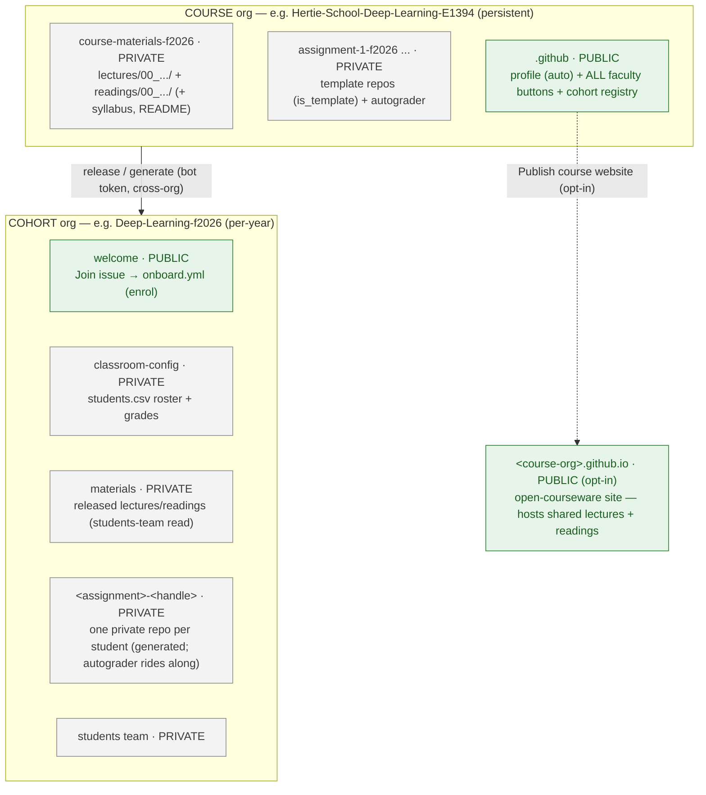

# DSL Teaching & Course Setup

Central registry of the workflows that deliver courses at the Hertie Data Science Lab.
Everything faculty-facing is a **GitHub Actions button**; the Python in `dsl_course/` is the
single implementation behind every button.

## The model

Two org tiers:
1. the **course** org is the faculty-facing control plane - the historical registry of
   course materials, persistent across years, where faculty push version-controlled materials
   from;
2. the **cohort** org is the per-year student-facing delivery target - materials are released
   here, student assignments are submitted and assessed here, and student-facing features
   (onboarding, the website) live here.

Each cohort gets an auto-deployed `<cohort>.github.io` site whose material links are private
(enrolled students only). Optionally, a course can also publish a **public**
`<course-org>.github.io` open-courseware site that shares its lectures + readings with the
world (see [Optional: public course website](#optional-public-course-website)).

## Deploying a course

Three phases - **set up the course** (once), **add a cohort** (per year), then **run it**
(release weekly). The step-by-step **runbooks live in [`docs/faculty/`](docs/faculty/README.md)** -
one per workflow, each naming the exact button, inputs, and order.

- **Checklist:** [the deployment checklist](docs/faculty/required-input-schema.md#deployment-checklist) - tickable, deploy-ordered.
- **Input schema:** [`docs/faculty/required-input-schema.md`](docs/faculty/required-input-schema.md) - the what-goes-where contract.
- **Worked example:** [`example-course/`](example-course/README.md) - a dummy course you can stand up end to end.

The only manual steps are creating each org in the GitHub web UI (there is no org-creation
API) and inviting **`hertie-dsl-bot`** as **Owner**
([which account?](docs/admin/admin-setup.md#the-bot-account)); everything after that is a button.

## Faculty actions

Every faculty action is a GitHub Actions button in the course org's bootstrapped `.github`
Actions tab. See the **[workflow runbooks](docs/faculty/README.md)** for the flows, or the
**[actions reference](docs/faculty/actions-reference.md)** for a one-page summary of every button.

---

**Admin & developer reference** (faculty delivering a course don't need this):
[`docs/admin/`](docs/admin/) - the [architecture](docs/admin/architecture.md) (system design,
token propagation, who-can-run access, the code map) and [operational setup](docs/admin/admin-setup.md)
(the bot credential, exact PAT scopes, the token/secret model).
