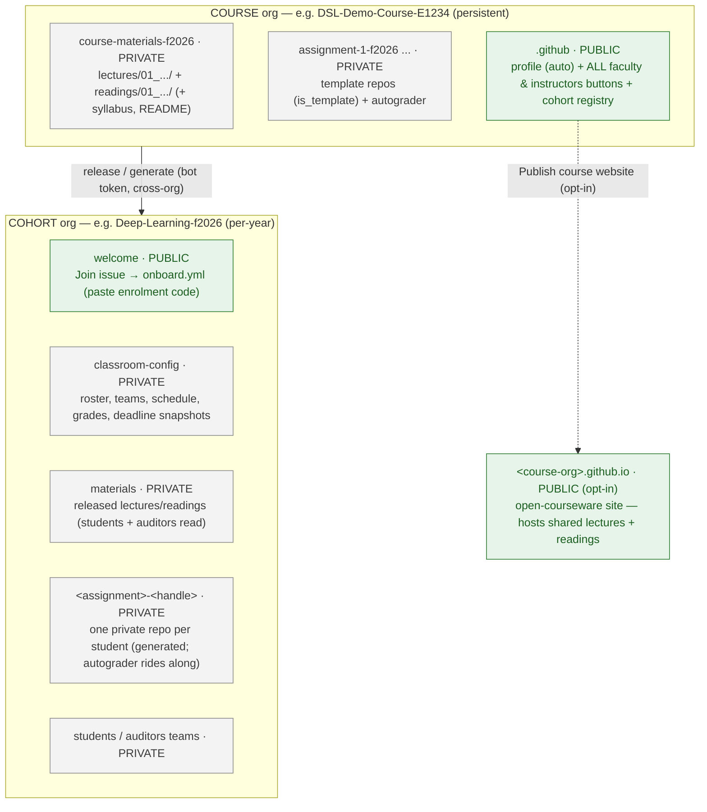

# DSL Teaching & Course Setup

Central registry of the workflows that deliver courses at the Hertie Data Science Lab. A course
lives once in a persistent **course** org and is delivered each year into a per-year **cohort**
org; everything faculty-facing is a **GitHub Actions button**, and the Python in `dsl_course/` is
the single implementation behind every one.

**[`docs/START-HERE.md`](docs/START-HERE.md)** routes you by persona and defines the vocabulary once:

| You are | Go to |
|---------|-------|
| Setting up or running a course | [workflow runbooks](docs/faculty-and-instructors/README.md) |
| A TA or faculty assistant (FA) joining a cohort | [`docs/ta-fa/`](docs/ta-fa/README.md) |
| A course admin inheriting a running course | [`course-admin.md`](docs/admin/course-admin.md) |
| An admin of the central `hertie-data-science-lab` org | [`central-admin.md`](docs/admin/central-admin.md) |

## Deploying a course

Three phases - **set up the course** (once), **add a cohort** (per year), then **run it**. Fill the
cohort's schedule in up front and an hourly cron runs the term: the schedule (`materials_releases`
in `schedule.yml`) is the primary release mechanism; the manual release buttons are the fallback -
for demos, one-offs, and recovery.

- **▶ Workflow runbooks — [`docs/faculty-and-instructors/`](docs/faculty-and-instructors/README.md) — start here.** One per workflow, each naming the exact button, inputs, and order.
- **Every button, one line each:** [actions reference](docs/faculty-and-instructors/actions-reference.md) - they all live in the course org's `.github` Actions tab, its **control panel**.
- **Worked example:** [`example-course/`](example-course/README.md) - a dummy course you can stand up end to end alongside the runbooks.
- **Input schema + deployment checklist** (reference): [`required-input-schema.md`](docs/faculty-and-instructors/required-input-schema.md) - the what-goes-where data contract, and a [tickable deploy-ordered checklist](docs/faculty-and-instructors/required-input-schema.md#deployment-checklist).

The only manual steps are creating each org in the GitHub web UI
([github.com/account/organizations/new](https://github.com/account/organizations/new) - there is no
org-creation API) and inviting **`hertie-dsl-bot`** as **Owner** (Org → People → Invite; the DSL
team must **accept** it before you bootstrap -
[which account?](docs/admin/admin-setup.md#the-bot-account)). Everything after that is a button.

## The model

Two org tiers:
1. the **course** org is the faculty-facing control panel - the persistent, historical registry
   of course materials, where faculty & instructors push version-controlled materials from;
2. the **cohort** org is the per-year student-facing delivery target - materials are released
   here, student assignments are submitted and assessed here, and student-facing features
   (onboarding, the website) live here.

```mermaid
flowchart TB
  subgraph COURSE["COURSE org — e.g. DSL-Demo-Course-E1234 (persistent)"]
    mat["course-materials-f2026 · PRIVATE<br/>lectures/01_.../ + readings/01_.../ (+ syllabus, README)"]
    tmpl["assignment-1-f2026 ... · PRIVATE<br/>template repos (is_template) + autograder"]
    gh[".github · PUBLIC<br/>profile (auto) + ALL faculty & instructors buttons + cohort registry"]
  end

  subgraph COHORT["COHORT org — e.g. Deep-Learning-f2026 (per-year)"]
    welcome["welcome · PUBLIC<br/>Join issue → onboard.yml (paste enrolment code)"]
    cfg["classroom-config · PRIVATE<br/>roster, teams, schedule, grades, deadline snapshots"]
    cmat["materials · PRIVATE<br/>released lectures/readings (students + auditors read)"]
    repos["&lt;assignment&gt;-&lt;handle&gt; · PRIVATE<br/>one private repo per student (generated; autograder rides along)"]
    team["students / auditors teams · PRIVATE"]
  end

  pub["&lt;course-org&gt;.github.io · PUBLIC (opt-in)<br/>open-courseware site — hosts shared lectures + readings"]

  COURSE -->|"release / generate (bot token, cross-org)"| COHORT
  gh -.->|"Publish course website (opt-in)"| pub

  classDef public fill:#e6f4ea,stroke:#2e7d32,color:#1b5e20;
  classDef private fill:#f3f3f3,stroke:#8a8a8a,color:#3c3c3c;
  class gh,welcome,pub public;
  class mat,tmpl,cfg,cmat,repos,team private;
```

Each cohort gets an auto-deployed `<cohort>.github.io` site whose material links are private
(enrolled students and auditors only). A course can optionally also publish a **public**
`<course-org>.github.io` open-courseware site - see [**Publish course website**](docs/faculty-and-instructors/actions-reference.md#optional-public-course-website).

---

**Admin & developer reference** (faculty & instructors delivering a course don't need this):
[`docs/admin/`](docs/admin/) - the [architecture](docs/admin/architecture.md) (system design,
token propagation, who-can-run access, the code map) and
[operational setup](docs/admin/admin-setup.md) (the bot credential, PAT scopes, secret model).
