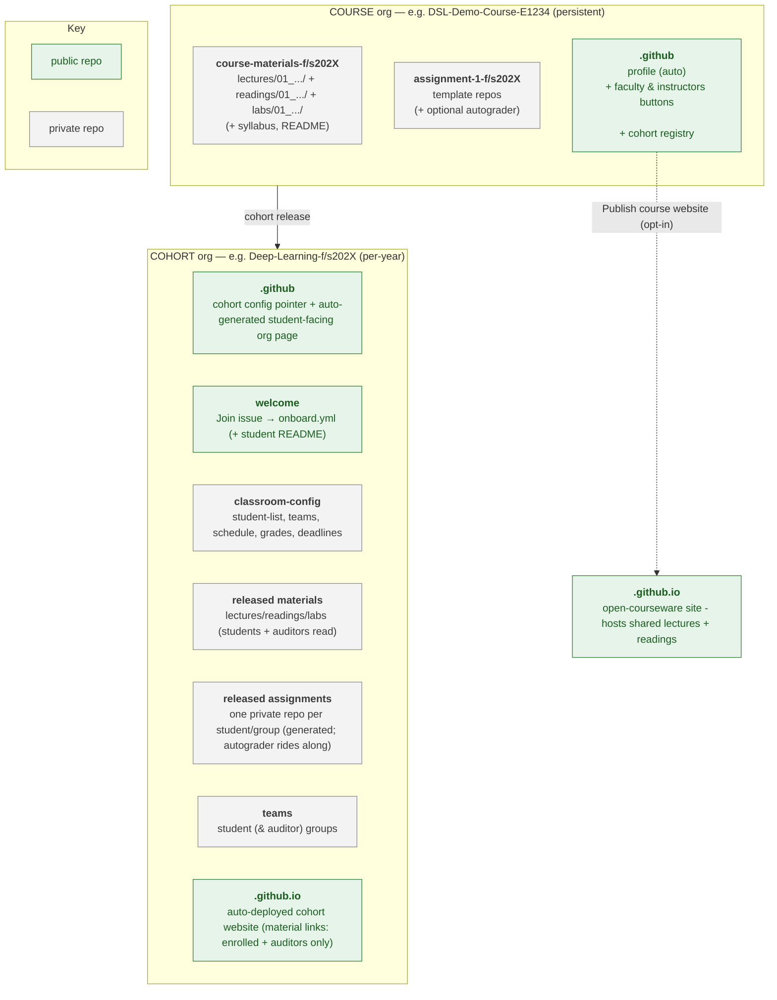

# DSL Teaching & Course Setup (GitHub delivery)

Central registry of the workflows that deliver courses at the Hertie Data Science Lab. A course lives once in a persistent **course** org and is delivered each year into a per-year **cohort** org; everything faculty-facing is a **GitHub Actions button**, and can be scheduled in advance at the start of the semester.

## Start here

| You are | Go to |
|---------|-------|
| Setting up a brand-new course | [workflow runbooks](docs/README.md) - [01](docs/01-new-course-org.md)-[03](docs/03-add-assignment-to-course.md) |
| Starting a new cohort / semester of an existing course | [04 New cohort org](docs/04-new-cohort-org.md) onwards |
| A TA or faculty assistant joining a cohort | [runbooks](docs/README.md) [06](docs/06-enrol-students-to-cohort.md)-[10](docs/10-grade-and-return-assignments.md) - skip 01-05 (setup; 05 is done for you by a course admin) |
| Granting someone access to a course - incl. **for a fixed term** | [05 Manage the teaching team](docs/05-manage-teaching-team.md) |

| Reference Materials | Go to |
|---------|-------|
| Chronological index of the e2e workflow | [the workflows](docs/README.md#the-workflows) |
| An example course setup | [`example course`](example-course/README.md) |
| Template artefacts | [`templates`](templates/classroom-config/README.md) |
| All available `.github` Actions tab buttons (course org) | [`actions reference`](docs/actions-reference.md) |
| Who may run those buttons, and which team grants it | [`access reference`](docs/access-reference.md) |
| **Deployment checklist** | [`DEPLOYMENT-CHECKLIST.md`](docs/DEPLOYMENT-CHECKLIST.md) |

## Deploying a course

2 phases:
1. [**set up the course org**](docs/01-new-course-org.md) (once)
   - [Add materials](docs/02-add-materials-to-course.md) - lectures slides, readings, labs, other
   - [Add assignments](docs/03-add-assignment-to-course.md) - a template repo that is copied into student private response repos, optionally contains a solutions branch
2. [**add a cohort org**](docs/04-new-cohort-org.md) (per year),
   - [Declare the teaching team](docs/05-manage-teaching-team.md) - this year's instructors & TAs, optionally with `start`/`end` dates so access lapses on its own
   - [Enrol students](docs/06-enrol-students-to-cohort.md)
   - [Define schedule up front](docs/07-schedule-releases.md) , to automate release/collect of materials, assignments & grading runs from course org -> cohort org (and/or manually release [materials](docs/08-release-materials-to-cohort.md) and [assignments](docs/09-release-assignment-to-cohort.md) on an ad hoc basis)
   - [Grade assignments](docs/10-grade-and-return-assignments.md)
      
> The only manually-required steps are (1) creating each org in the GitHub web UI ([github.com/account/organizations/new](https://github.com/account/organizations/new)) and (2) [inviting **`hertie-dsl-bot`** as an org **Owner**](docs/01-new-course-org.md#steps); the DSL team must **accept** it before you bootstrap. Everything after that is automated via the scheduler / a button click.
> *NB: if email integration is not currently live, then it may be necessary to email students their initial course invite codes as well.* 

## The model

Two org tiers:
1. the **course** org is the faculty-facing control panel - the persistent, historical registry, of course materials & assignments, where faculty & instructors push version-controlled materials from;
2. the **cohort** org is the per-year student-facing delivery target - materials are released here, student assignments are submitted and assessed here, and student-facing features (onboarding, the website) live here.

```mermaid
flowchart TB
  subgraph COURSE["COURSE org — e.g. DSL-Demo-Course-E1234 (persistent)"]
    mat["`**course-materials-f/s202X**

lectures/01_.../ + readings/01_.../ + labs/01_.../

(+ syllabus, README)`"]
    tmpl["`**assignment-1-f/s202X**

template repos

(+ optional autograder)`"]
    gh["`**.github**

profile (auto)

+ faculty & instructors buttons

+ cohort registry`"]
  end

  subgraph COHORT["COHORT org — e.g. Deep-Learning-f/s202X (per-year)"]
    cgh["`**.github**

cohort config pointer + auto-generated student-facing org page`"]
    welcome["`**welcome**

Join issue → onboard.yml (+ student README)`"]
    cfg["`**classroom-config**

student-list, teams, schedule, grades, deadlines`"]
    cmat["`**released materials**

lectures/readings/labs (students + auditors read)`"]
    repos["`**released assignments**

one private repo per student/group (generated; autograder rides along)`"]
    team["`**teams**

student (& auditor) groups`"]
    site["`**<cohort>.github.io**

auto-deployed cohort website (material links: enrolled + auditors only)`"]
  end

  pub["`**<course-org>.github.io**

open-courseware site - hosts shared lectures + readings`"]

  COURSE -->|"cohort release"| COHORT
  gh -.->|"Publish course website (opt-in)"| pub

  subgraph KEY["Key"]
    keypub["public repo"]
    keypriv["private repo"]
  end

  classDef public fill:#e6f4ea,stroke:#2e7d32,color:#1b5e20;
  classDef private fill:#f3f3f3,stroke:#8a8a8a,color:#3c3c3c;
  class gh,cgh,welcome,site,pub,keypub public;
  class mat,tmpl,cfg,cmat,repos,team,keypriv private;
```

Each cohort gets an auto-deployed `<cohort>.github.io` site whose material links are private (enrolled students and auditors only). A course can optionally also publish a **public** `<course-org>.github.io` open-courseware site - see [**Publish course website**](docs/actions-reference.md#optional-public-course-website).

## Glossary

| Term | Meaning |
|------|---------|
| **Course org** | the persistent org for a course (e.g. `DSL-Demo-Course-E1234`): materials repos, assignment templates, the control panel. Lives across all years. |
| **Cohort org** | one org per semester delivery (e.g. `DSL-Demo-f2026`): roster, released materials, per-student repos, grades, the cohort website. Fresh each year. |
| **Tag** | the `fYYYY`/`sYYYY` suffix naming a delivery (`f2026` = Fall 2026, s2027 = Summer 2027). Scopes the year's content repos and teams. |
| **Control panel** | the course org's `.github` repo - its **Actions** tab holds every workflow button, for the course org and all its cohorts. Cohort orgs have no buttons of their own. |
| **`course-admin` team** | the course's standing owners, declared once in the course org's `.github/dsl-course.yml` (`course_admins`), mirrored into every cohort. |
| **SSOT** | single source of truth. The course org is the SSOT for all content; each cohort's `classroom-config` is the SSOT for that specific cohort's student roster, teams, schedule and grades. |
| **The bot** | `hertie-dsl-bot`, the machine account behind every action. Must be an **Owner** of every org - the one irreducible manual step. See [admin-setup](docs-admin-arch/admin-setup.md#the-bot-account). |

---

**Admin & developer reference** (faculty & instructors delivering a course don't need this): [`docs-admin-arch/`](docs-admin-arch/) - the [architecture](docs-admin-arch/architecture.md) (system design, token propagation, who-can-run access, the code map) and
[operational setup](docs-admin-arch/admin-setup.md) (the bot credential, PAT scopes, secret model).
