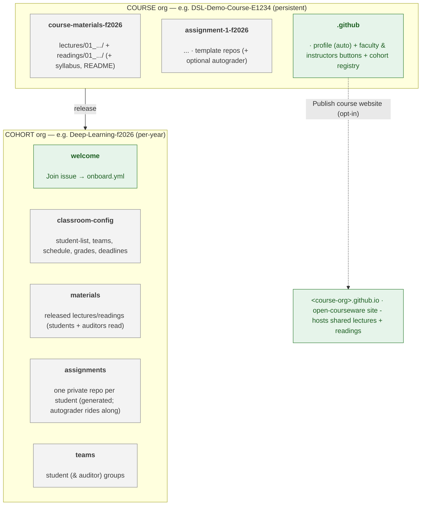

# DSL Teaching & Course Setup (GitHub delivery)

Central registry of the workflows that deliver courses at the Hertie Data Science Lab. A course lives once in a persistent **course** org and is delivered each year into a per-year **cohort** org; everything faculty-facing is a **GitHub Actions button**, and can be scheduled in advance at the start of the semester.

## Getting Started
>**[`docs/START-HERE.md`](docs/START-HERE.md)** is the expected point of entry.

Here are some further useful links:

| You are | Go to |
|---------|-------|
| Setting up a new course | [workflow runbooks](docs/faculty-and-instructors/README.md) |
| A course admin inheriting a running course | [`course-admin.md`](docs/admin/course-admin.md) |
| A TA or faculty assistant joining a cohort | [`docs/ta-fa/`](docs/ta-fa/README.md) |
| An example course | [`example course`](example-course/README.md) |
| Template artefacts| [`templates`](templates/classroom-config/README.md) |
| Every workflow in the course org's `.github` Actions tab | [`actions reference`](docs/faculty-and-instructors/actions-reference.md) |
| Input schema + deployment checklist | [`required-input-schema.md`](docs/faculty-and-instructors/required-input-schema.md)|

## Deploying a course

- Three phases:
   - (1) [**set up the course org**](docs/faculty-and-instructors/01-new-course-org.md) (once),
   - (2) [**add a cohort org**](docs/faculty-and-instructors/04-new-cohort-org.md) (per year), 
   - (3) **run it**. 
- Fill the cohort's schedule up front (in the `materials_releases` block in `schedule.yml`) and all materials, assignments, hands-ins, grades & feedback etc will be **automatically released/collected**.
- Otherwise use the manual GitHub actions found in the course/cohort org's `.github` repository to run specific ad hoc workflows
- The only manual steps are (1) creating each org in the GitHub web UI
([github.com/account/organizations/new](https://github.com/account/organizations/new) and (2) [inviting **`hertie-dsl-bot`** as an org **Owner**](docs/faculty-and-instructors/01-new-course-org.md#steps); the DSL team must **accept** it before you bootstrap. Everything after that is automated via the scheduler / a button click.

## The model

Two org tiers:
1. the **course** org is the faculty-facing control panel - the persistent, historical registry, of course materials & assignments, where faculty & instructors push version-controlled materials from;
2. the **cohort** org is the per-year student-facing delivery target - materials are released here, student assignments are submitted and assessed here, and student-facing features (onboarding, the website) live here.

```mermaid
flowchart TB
  subgraph COURSE["COURSE org — e.g. DSL-Demo-Course-E1234 (persistent)"]
    mat["<strong>course-materials-f2026</strong>

lectures/01_.../ + readings/01_.../ (+ syllabus, README)"]
    tmpl["<strong>assignment-1-f2026</strong>

... · template repos (+ optional autograder)"]
    gh["<strong>.github</strong>

· profile (auto) + faculty & instructors buttons + cohort registry"]
  end

  subgraph COHORT["COHORT org — e.g. Deep-Learning-f2026 (per-year)"]
    welcome["<strong>welcome</strong>

Join issue → onboard.yml"]
    cfg["<strong>classroom-config</strong>

student-list, teams, schedule, grades, deadlines"]
    cmat["<strong>materials</strong>

released lectures/readings (students + auditors read)"]
    repos["<strong>assignments</strong>

one private repo per student (generated; autograder rides along)"]
    team["<strong>teams</strong>

student (& auditor) groups"]
  end

  pub["&lt;course-org&gt;<course>.github.io · open-courseware site - hosts shared lectures + readings"]

  COURSE -->|"release"| COHORT
  gh -.->|"Publish course website (opt-in)"| pub

  classDef public fill:#e6f4ea,stroke:#2e7d32,color:#1b5e20;
  classDef private fill:#f3f3f3,stroke:#8a8a8a,color:#3c3c3c;
  class gh,welcome,pub public;
  class mat,tmpl,cfg,cmat,repos,team private;
```

Each cohort gets an auto-deployed `<cohort>.github.io` site whose material links are private (enrolled students and auditors only). A course can optionally also publish a **public** `<course-org>.github.io` open-courseware site - see [**Publish course website**](docs/faculty-and-instructors/actions-reference.md#optional-public-course-website).

---

**Admin & developer reference** (faculty & instructors delivering a course don't need this): [`docs/admin/`](docs/admin/) - the [architecture](docs/admin/architecture.md) (system design, token propagation, who-can-run access, the code map) and
[operational setup](docs/admin/admin-setup.md) (the bot credential, PAT scopes, secret model).
