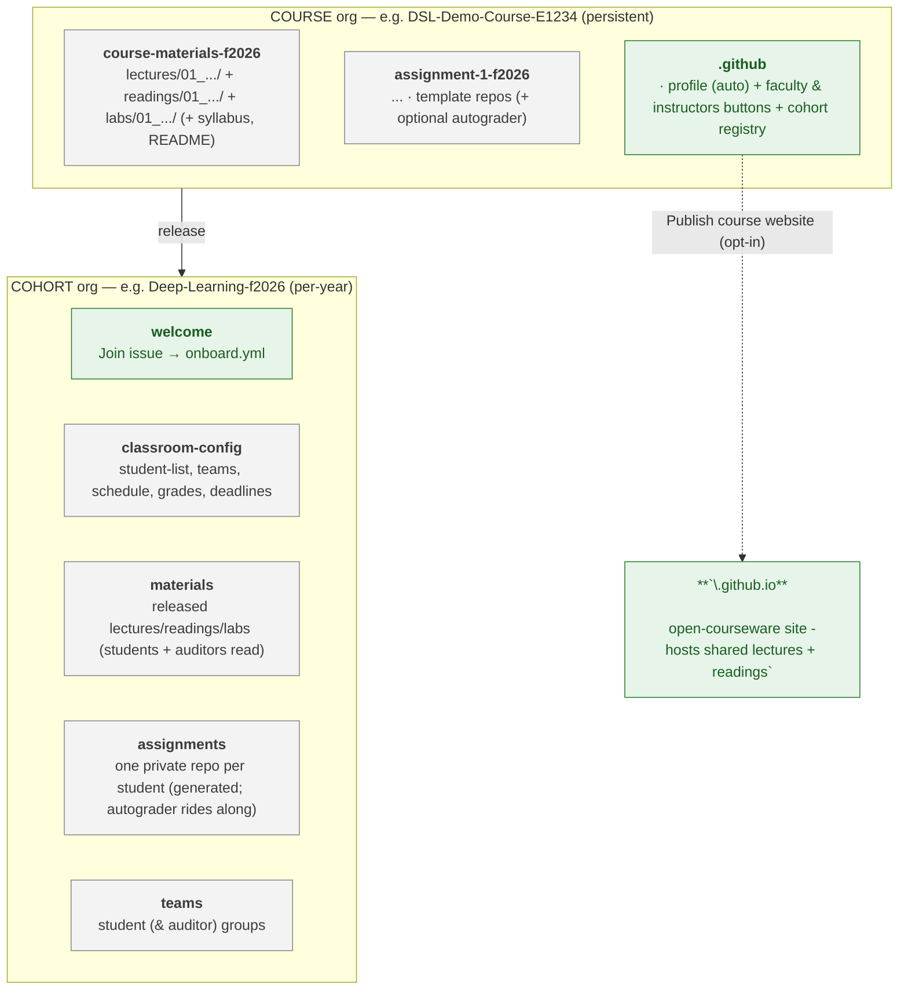

# DSL Teaching & Course Setup (GitHub delivery)

Central registry of the workflows that deliver courses at the Hertie Data Science Lab. A course lives once in a persistent **course** org and is delivered each year into a per-year **cohort** org; everything faculty-facing is a **GitHub Actions button**, and can be scheduled in advance at the start of the semester.

## Start here

| You are | Go to |
|---------|-------|
| Setting up a brand-new course | [workflow runbooks](docs/faculty-and-instructors/README.md) - [01](docs/faculty-and-instructors/01-new-course-org.md)-[03](docs/faculty-and-instructors/03-add-assignment-to-course.md) |
| Starting a new cohort / semester of an existing course | [04 New cohort org](docs/faculty-and-instructors/04-new-cohort-org.md) onwards |
| A TA or faculty assistant joining a cohort | [runbooks](docs/faculty-and-instructors/README.md) [05](docs/faculty-and-instructors/05-enrol-students-to-cohort.md)-[09](docs/faculty-and-instructors/09-grade-and-return-assignments.md) - skip 01-04 (setup) |

| Reference Materials | Go to |
|---------|-------|
| Chronological index of e2e worksflow| [workflpws](docs/faculty-and-instructors#the-workflows)
| An example course setup | [`example course`](example-course/README.md) |
| Template artefacts | [`templates`](templates/classroom-config/README.md) |
| All available `.github` Actions tab bottons (course org) | [`actions reference`](docs/faculty-and-instructors/actions-reference.md) |
| **Deployment checklist** | [`required-input-schema.md`](docs/faculty-and-instructors/required-input-schema.md) |

## Deploying a course

- Three phases:
   - (1) [**set up the course org**](docs/faculty-and-instructors/01-new-course-org.md) (once),
   - (2) [**add a cohort org**](docs/faculty-and-instructors/04-new-cohort-org.md) (per year),
   - (3) Set up the schedule up front, and/or manually release.
- Fill the cohort's schedule up front (in the `materials_releases` block in `schedule.yml`) and all materials, assignments, hand-ins, grades & feedback etc will be **automatically released/collected**.
- Otherwise use the manual GitHub Actions buttons in the course org's `.github` repository to run specific ad hoc workflows.
- The only manual steps are (1) creating each org in the GitHub web UI
([github.com/account/organizations/new](https://github.com/account/organizations/new)) and (2) [inviting **`hertie-dsl-bot`** as an org **Owner**](docs/faculty-and-instructors/01-new-course-org.md#steps); the DSL team must **accept** it before you bootstrap. Everything after that is automated via the scheduler / a button click.
   - NB: if email integration is not currently live, then it may be necessary to email students their invite codes. 

## Glossary

| Term | Meaning |
|------|---------|
| **Course org** | the persistent org for a course (e.g. `DSL-Demo-Course-E1234`): materials repos, assignment templates, the control panel. Lives across all years. |
| **Cohort org** | one org per delivery (e.g. `DSL-Demo-f2026`): roster, released materials, per-student repos, grades, the cohort website. Fresh each year. |
| **Tag** | the `fYYYY`/`sYYYY` suffix naming a delivery (`f2026` = Fall 2026). Scopes the year's content repos and teams. |
| **Control panel** | the course org's `.github` repo - its **Actions** tab holds every workflow button, for the course org and all its cohorts. Cohort orgs have no buttons of their own. |
| **`course-admin` team** | the course's standing owners, declared once in the course org's `.github/dsl-course.yml` (`course_admins`), mirrored into every cohort. |
| **SSOT** | single source of truth. The course org is the SSOT for content; each cohort's `classroom-config` for that cohort's roster, teams, schedule and grades. |
| **The bot** | `hertie-dsl-bot`, the machine account behind every action. Must be an **Owner** of every org - the one irreducible manual step. See [admin-setup](docs/admin/admin-setup.md#the-bot-account). |

## The model

Two org tiers:
1. the **course** org is the faculty-facing control panel - the persistent, historical registry, of course materials & assignments, where faculty & instructors push version-controlled materials from;
2. the **cohort** org is the per-year student-facing delivery target - materials are released here, student assignments are submitted and assessed here, and student-facing features (onboarding, the website) live here.

```mermaid
flowchart TB
  subgraph COURSE["COURSE org — e.g. DSL-Demo-Course-E1234 (persistent)"]
    mat["`**course-materials-f2026**

lectures/01_.../ + readings/01_.../ + labs/01_.../ (+ syllabus, README)`"]
    tmpl["`**assignment-1-f2026**

... · template repos (+ optional autograder)`"]
    gh["`**.github**

· profile (auto) + faculty & instructors buttons + cohort registry`"]
  end

  subgraph COHORT["COHORT org — e.g. Deep-Learning-f2026 (per-year)"]
    welcome["`**welcome**

Join issue → onboard.yml`"]
    cfg["`**classroom-config**

student-list, teams, schedule, grades, deadlines`"]
    cmat["`**materials**

released lectures/readings/labs (students + auditors read)`"]
    repos["`**assignments**

one private repo per student (generated; autograder rides along)`"]
    team["`**teams**

student (& auditor) groups`"]
  end

  pub["**`\<course-org\>.github.io**

 open-courseware site - hosts shared lectures + readings`"]

  COURSE -->|"release"| COHORT
  gh -.->|"Publish course website (opt-in)"| pub

  classDef public fill:#e6f4ea,stroke:#2e7d32,color:#1b5e20;
  classDef private fill:#f3f3f3,stroke:#8a8a8a,color:#3c3c3c;
  class gh,welcome,pub public;
  class mat,tmpl,cfg,cmat,repos,team private;
```

Each cohort gets an auto-deployed `<cohort>.github.io` site whose material links are private (enrolled students and auditors only). A course can optionally also publish a **public** `<course-org>.github.io` open-courseware site - see [**Publish course website**](docs/faculty-and-instructors/actions-reference.md#optional-public-course-website).

---

**Admin & developer reference** (faculty & instructors delivering a course don't need this): [`docs/admin/`](docs/admin/) - the [architecture](docs/admin/architecture.md) (system design, token propagation, who-can-run access, the code map) and
[operational setup](docs/admin/admin-setup.md) (the bot credential, PAT scopes, secret model).
