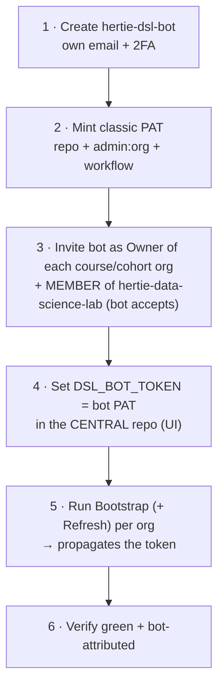

# Central admin - the DSL org

Who may provision course orgs, how to rotate the bot's token, and where to see which orgs exist.
Per-course access: [course-admin.md](course-admin.md). PAT scopes and the token model:
[admin-setup.md](admin-setup.md).

## Granting a new faculty member access

There is no config file for this. **Someone already in `hertie-data-science-lab` adds the new
person to its `faculty` (or `admin`) team via the GitHub Teams UI** - that is the only way in,
and it gates every central button.

- **Bootstrap Course Org** checks membership of those two teams. No membership, no org
  provisioning.
- Already in place as one-time setup: the central `dsl-teaching-course-setup` repo grants
  **`faculty` → write** and **`admin` → admin**, and its `main` is **branch-protected** (changes
  go via PR).
- This authority is DSL-wide and *creation-only*. It grants **no** access to any course's own
  buttons - those come from that course org's `course-admin` / `instructors-<tag>` teams
  ([course-admin.md](course-admin.md)).

## Bot lifecycle - setup & rotation

Every org holds its **own copy** of the bot's PAT (an org secret, plus repo secrets on private
repos on the Free plan), so rotating the token is a per-org operation, not one edit.

**Rotation:** mint a fresh PAT (2), set it in the central repo (4), re-run Bootstrap + Refresh
(5) **for every org** - a central edit alone changes nothing out there - verify (6), then
**revoke the previous PAT last**, only after *every* org verifies green under the new one. Set a
PAT expiry so rotation is forced.

**Hard rules** (ordering is not optional):

- **Owner before token.** Invite the bot as Owner and have it accept (3) before propagating (5).
- **The bot must be a member of the central org.** Bootstrap's team gate reads
  `hertie-data-science-lab`'s teams **under `DSL_BOT_TOKEN`**; without that membership the gate
  **denies everyone**. Member is enough; it needn't be an owner there.
- **Swap central only after a one-org test.** Setting the central secret (4) doesn't touch
  existing org secrets, so it's safe - but prove it on one org before the rest.
- **Never paste a token into chat, PRs, or issues.** Set it *only* via the Secrets UI; a token
  exposed anywhere must be **revoked and reissued** immediately.

## Before bootstrapping a new org

- Create the org by hand in the GitHub web UI (there is no org-creation API).
- Invite the bot as an **Owner** and have it **accept** before Bootstrap runs - an unaccepted
  invite makes the run fail. Same for cohort orgs.
- Walkthroughs: [01-new-course-org.md](../docs/01-new-course-org.md) and
  [04-new-cohort-org.md](../docs/04-new-cohort-org.md).

## Email

Enrolment-code and grade emails go through `dsl_course.mailer` under a **tenant-level mail
credential** - a one-time central setup, not per course. `dry_run` previews need nothing.

- **Microsoft Graph (preferred)** - secrets `GRAPH_TENANT_ID`, `GRAPH_CLIENT_ID`,
  `GRAPH_CLIENT_SECRET`, `GRAPH_SENDER`. Needs an Entra app registration with the **Mail.Send**
  application permission, admin-consented, scoped to one shared mailbox (Exchange application
  access policy), plus that shared mailbox as the sender.
- **SMTP (fallback)** - `SMTP_HOST`, `SMTP_USER`, `SMTP_PASSWORD` (+ optional `SMTP_PORT`,
  `SMTP_FROM`). Most M365 tenants disable SMTP AUTH (error `5.7.139`), so Graph is usually the
  only viable route.

Set the secrets once; they must reach each course org's `.github` repo (where the send
workflows run). **Status: not yet configured in any DSL org** - a request to Hertie IT for the
Entra app registration is pending.

## What orgs exist

**[`inventory/course-orgs.md`](../inventory/course-orgs.md)** is the live list. It is
auto-generated **Mondays 06:00 UTC** (and on demand) and opens a PR when the list changed. Don't
hand-edit it - a missing org means a failed or never-run bootstrap, not a forgotten edit.

## Related

- [admin-setup.md](admin-setup.md) - the bot account, exact PAT scopes, token/secret model.
- [course-admin.md](course-admin.md) - per-course access and the instructors teams.
- [architecture.md](architecture.md) - diagrams, workflow sequences, code map.
