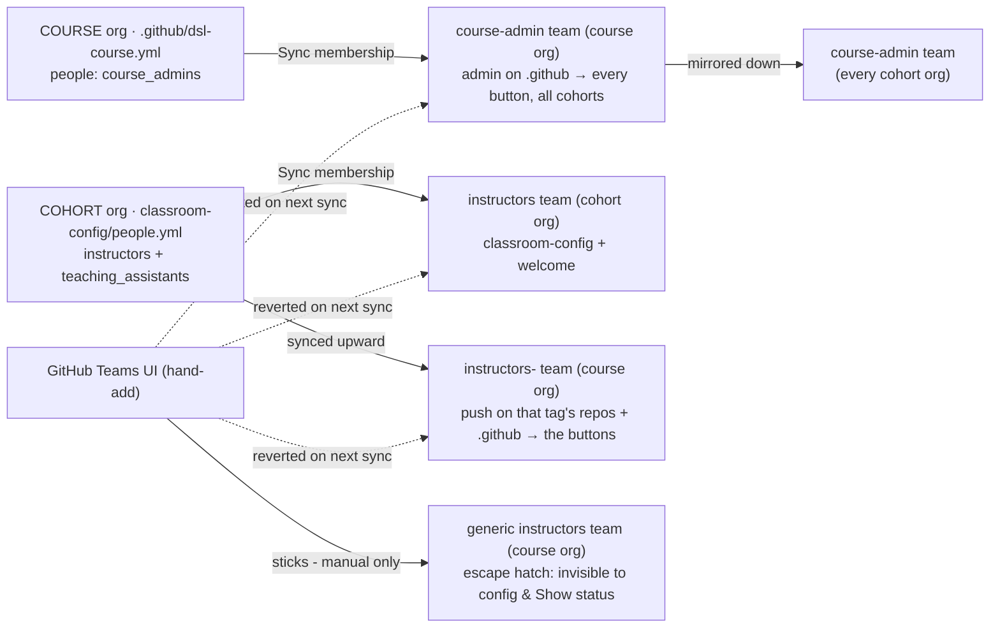

# Course admin - running an existing course

You're an admin of a course org that's already running. This page covers what that grants and
how access is declared and revoked.

- Button-by-button walkthroughs: **[runbooks](../docs/README.md)**
- New to the platform: the **[root README](../README.md)** (routing + glossary)
- Input files and their schemas:
  **[DEPLOYMENT-CHECKLIST.md](../docs/DEPLOYMENT-CHECKLIST.md)**

**Start by running [Show status](../docs/actions-reference.md) on each
cohort** (course org's `.github` Actions tab → **Show status**). It is read-only and prints a
per-cohort checklist - identity, people, schedule + release plan, roster, teams, grades - with
edit links for anything missing.

## What course-admin membership grants

Membership of **that course org's own `course-admin` team** makes **every** button in that org's
Actions tab visible and runnable, across all its cohorts. It is scoped to **one course**;
central `hertie-data-science-lab` membership gates only org *provisioning*
([central-admin.md](central-admin.md)) and grants nothing here.

Cron-driven runs (**Scheduled release**, and the automatic paths of **Sync site** /
**Sync membership** / **Publish course website**) skip the access gate.

> **Publish course website:** `actual-readings` mode hosts the reading files publicly. Only
> publish what you hold the rights to share - use `reading-list` for copyrighted readings.

## How access is declared

Access is **declared in config files and reconciled**, not clicked. **Sync membership** runs on
push to those files and on a daily cron, adding *and removing* to match:

- **Admin rights** (course-wide, every cohort): the course org's `.github/dsl-course.yml`
  `people:` → `course_admins`, or the **`admin`** input at bootstrap. Deleting an entry revokes
  access on the next sync.
- **Push rights** (one cohort's content only): that cohort's own
  `classroom-config/people.yml` → `instructors` / `teaching_assistants`. Removing someone there
  revokes both their cohort-team and their `instructors-<tag>` access.

**Hand-added members get reverted.** Adding someone to `course-admin`, a cohort's `instructors`
team, or `instructors-<tag>` through the GitHub Teams UI survives only until the next Sync
membership run, which removes anyone the config doesn't name. Edit the file instead.

New members accept a one-time org invite (membership shows `pending` until they do), then the
buttons appear in their Actions tab. Students never get write, so never see them.

## The three `instructors` teams

Three different teams share the word "instructors" - they are not interchangeable:

| Team | Lives in | Declared by | Grants |
| --- | --- | --- | --- |
| `instructors` | a **cohort** org | that cohort's `classroom-config/people.yml` | cohort-org membership for that year's instructors/TAs; reconciled |
| `instructors-<tag>` | the **course** org | the same `people.yml` (tag = e.g. `f2026`) | push on `.github` + that tag's content repos, i.e. the buttons for that cohort; reconciled |
| `instructors` | the **course** org (generic) | nothing - manual | a rare, permanent escape hatch |

The generic course-org `instructors` team is the exception: a manual add sticks until manually
removed, but it is **invisible to every config file and to Show status**. Use it sparingly and
record who's on it elsewhere. Route FA (faculty assistant) and TA access through `people.yml`.

## Related

- [central-admin.md](central-admin.md) - central DSL-org authority: who can create orgs, the bot
  and its rotation, the org inventory.
- [admin-setup.md](admin-setup.md) - the bot account, its PAT scopes, and the token model.
- [architecture.md](architecture.md) - how the pieces move.
