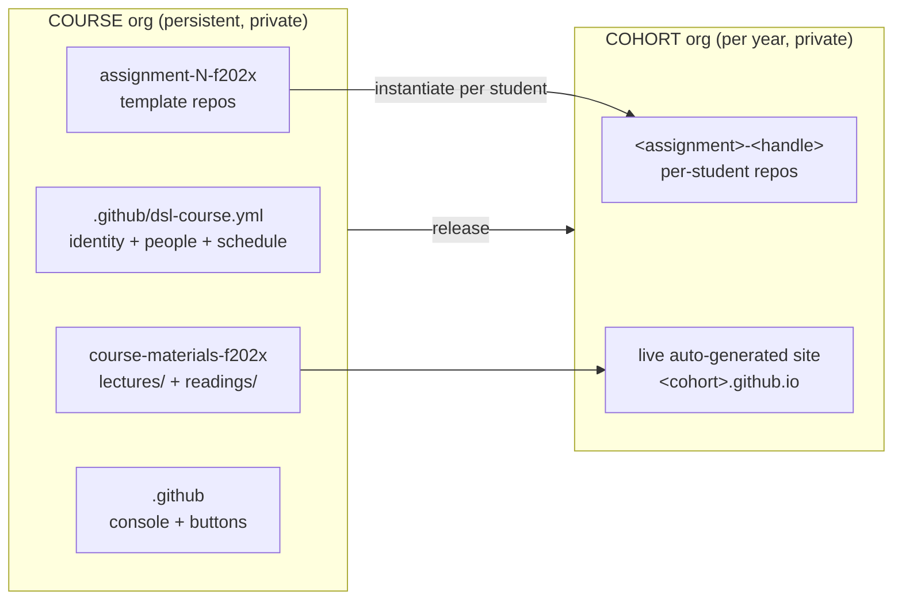

# Required input schema

This is the authoritative checklist of **every input** needed to stand up a fully working
course + cohort from scratch. For a ready-to-run worked example
with dummy data, see [`example-course/`](../example-course/README.md).

Everything faculty-facing is a **GitHub Actions button** (also exposed as CLI commandds). The Python
in `dsl_course/` is the single implementation behind every button.

## Deployment checklist

The fast path: tick these off in order. `[required]` must be done to deploy; everything else
is synthesised or skipped if you leave it. Each item names the **exact place** the input
lives - the [grouped tables](#the-inputs-grouped) below expand on every one. (Copy this block
into a tracking issue and tick as you go.)

### Course setup (once)

- [ ] `[required]` Create the **course org** in the GitHub web UI, then add **`hertie-dsl-bot`** as **Owner** (the one manual step - no org-creation API).
- [ ] `[required]` Run [**Bootstrap Course Org**](https://github.com/hertie-data-science-lab/dsl-teaching-course-setup/actions/workflows/bootstrap-org.yml) from this repo's Actions tab (`org`, `org_name`; optional `course_name`, `course_code`, `admin`). This also sets `DSL_BOT_TOKEN` on the org - you don't set the secret by hand. See [Token](#token).
- [ ] `[required]` **Materials**: scaffold with **New materials repo**, then fill `course-materials-fYYYY/lectures/week-N/` and `readings/week-N/` with any files. *(optional: a `*syllabus*` file + `README` at the repo root.)*
- [ ] `[required]` **Assignments** (≥1): scaffold with **New assignment**, then on `main` add the brief (`README.md`) + starter. *(optional: solutions go in a `solution/` folder on a branch named `solution`; an autograder at `.github/workflows/autograde.yml`.)*
- [ ] *(optional)* **People**: edit the `people:` block in `.github/dsl-course.yml` (instructor/TA cards). If omitted, falls back to GitHub teams + avatars.
- [ ] *(optional)* **Schedule**: edit the `schedule:` block in `.github/dsl-course.yml` (real dates). If omitted, dates are synthesised.
- [ ] `[required]` Run **Refresh actions** so every content repo gets its Release buttons, the secret propagates, and all dropdowns populate.

### Cohort setup (per year)

- [ ] `[required]` Create the **cohort org** in the GitHub web UI; add **`hertie-dsl-bot`** as **Owner**.
- [ ] `[required]` Run **Bootstrap cohort** (`cohort` ticked, `course` = parent course org). Seeds `welcome` + `classroom-config`, scaffolds the site, registers the cohort, propagates the token.
- [ ] `[required]` **Roster**: edit `classroom-config/students.csv` with registrar data - `student_id, hertie_email, name, section`. Leave `github_handle, github_id` blank; students fill them by onboarding.
- [ ] `[required]` Run the weekly loop: **Release materials** (per week) and **Release assignment** (per assignment). Students onboard themselves via the **Join** issue in `welcome`; **Enroll student** is the faculty override.

## What you end up with



The course org is the source of truth; the cohort org receives releases of it.

## The input-schema contract

Every part of a course has **one canonical place**. Put your inputs there, run the
buttons, and the pipeline reads them and generates a full, delivery-ready course +
website. 

1. `.github/dsl-course.yml` is the **course config contract** (identity + people + schedule);
2. `course-materials-fYYYY` repo is the **content contract** (lectures/readings/syllabus by week);
3. `assignment-*-fYYYY` template repos are the **assignment contract**; 
4. the cohort `students.csv` is the **roster contract**.
  
The pipeline: `Bootstrap → Release materials/assignment → (auto) Sync site` - turns those inputs into the
running course. _Anything you don't supply is synthesised or skipped, never blocks._

| Element | Input location | Becomes on the site / cohort |
|-------|-----------------|------------------------------|
| **Course identity** (name, code) | `.github/dsl-course.yml` → `org_name`, `course_name`, `course_code` |  site title + header |
| **Semester** | derived from the cohort org's `fYYYY`/`sYYYY` tag |  "Fall 2026" + schedule anchor |
| **People** (instructors, TAs) | `.github/dsl-course.yml` → `people:` block (`name`, `photo`, `url`, `title`) |  instructor/TA cards (institutional headshots + bio links) |
| **Schedule** (semester start, due dates, exams) | `.github/dsl-course.yml` → `schedule:` block |  the schedule table (lectures, due dates, exams) |
| **Lectures** | `course-materials-fYYYY/lectures/week-N/` (any files) |  weekly lecture entries linking the released files |
| **Readings** | `course-materials-fYYYY/readings/week-N/` (any files) |  weekly reading links |
| **Syllabus** | `course-materials-fYYYY/` root file matching `*syllabus*` |  cohort root + syllabus link |
| **Assignments** | `assignment-N-fYYYY` template repo: `README.md` (brief), `starter.*`, `solution` branch, `.github/workflows/autograde.yml` | assignment briefs on the site + one private `<slug>-<handle>` repo per student |
| **Roster** | cohort `classroom-config/students.csv` (`student_id, hertie_email, name, section`) | enrolment + per-student provisioning |

## The inputs, grouped

### A. One-time, manual (cannot be automated)

| # | Input | How / where | Notes |
|---|-------|-------------|-------|
| A1 | **Create the course org** | GitHub web UI | GitHub has **no org-creation API** ([ADR 0011 §9]). Add the bot account as an **owner**. |
| A2 | **Create the cohort org** | GitHub web UI | Same - one per year. Add the bot as owner. |
| A3 | **`DSL_BOT_TOKEN`** | The bot's classic PAT | Scopes: `repo` + `admin:org` + `workflow`. The bot must be **owner on both orgs**. This is the only secret. See [Token](#token). |

Everything below is a button or a file edit.

### B. Course org content (persistent)

| # | Input | Supplied via | Mandatory | Stored as |
|---|-------|--------------|-----------|-----------|
| B1 | Course identity: `org`, `org_name`, `course_name`, `course_code` | **Bootstrap Course Org** button inputs | org + org_name | `.github/dsl-course.yml` |
| B2 | **People** (instructors + TAs: name, photo, bio link, title) | Edit the `people:` block in `.github/dsl-course.yml` | for the site cards | declared input → cards carry institutional headshots + bio links. *(If omitted, falls back to the `instructors`/`teaching-assistants` GitHub teams → GitHub avatars.)* |
| B3 | **Materials**: a `course-materials-fYYYY` repo with `lectures/week-N/` and `readings/week-N/` folders | **New materials repo** button scaffolds it; you add files | yes | course org repo |
| B4 | Syllabus / root README (optional) | Files at the materials-repo root | optional | copied to the cohort on release if toggled on |
| B5 | **Assignments**: one `assignment-N-fYYYY` **template** repo each (starter + autograder on `main`, empty `solution` branch) | **New assignment** button scaffolds it; you add the brief + starter | yes | course org template repos (`is_template`) |
| B6 | **Schedule dates** (assignment due dates, exam dates, real semester start) | Edit the `schedule:` block in `.github/dsl-course.yml` | optional (synthesised if blank) | see [Schedule](#the-schedule) |
| B7 | **Release manifest** (optional, for scheduled auto-release): `weeks:` → what opens each week (`materials` / `code` paths / `assignment`) | Edit `.github/release-manifest.yml` | no (manual buttons work without it) | course org `.github` repo |

### C. Per-cohort (each year)

| # | Input | Supplied via | Mandatory |
|---|-------|--------------|-----------|
| C1 | The empty cohort org name | **Bootstrap cohort** button | yes |
| C2 | **Roster**: registrar columns of `students.csv` (`student_id, hertie_email, name, section`) | Edit `classroom-config/students.csv` (private) | yes |
| C3 | **Grades** (optional, when returning marks): one CSV per assignment, `classroom-config/grades/<assignment>.csv` (`github_handle, team, team_grade, adjustment, final, comments`) | Edit the CSV (private), then **Sync gradebooks** → **Render grades** → **Distribute grades** | no |
| C4 | **Teams** (optional, for group assignments): `classroom-config/teams.csv` (`assignment, team, github_handle`) | Students self-select via the welcome **Join team** issue, or faculty edit the CSV directly | no |
| C5 | **Calendar** (optional, pairs with the release manifest): `classroom-config/schedule.csv` (`week, date`) | Edit the CSV; the daily **Scheduled release** cron opens each week's manifest items on its date | no |

`github_handle` and `github_id` are **left blank** - students fill them by onboarding (below).

**Grades are private and previewable.** Each student gets one private `grades-<handle>`
repo (the single home for every mark - team project repos may be public, so grades never
go there). For an individual assignment, fill just `final` + `comments`; for a group
project, fill `team`, `team_grade`, and that member's private `adjustment` (`final` is
authoritative). **Render grades** builds per-student `gradebook/<handle>.yml` and opens one
PR - *that diff is the preview* - and **Distribute grades** fans the merged files out to
each private repo. A teammate never sees another member's adjustment: it lives only in
their own repo.

### D. Per-student (self-service, no faculty input)

A student opens a **Join** issue in `welcome` and types their **university email**. The
onboard workflow does the rest. See [How students are managed](#how-students-are-managed).

## How students are managed

Student lifecycle is **two separate stages** - *enrol once, provision per assignment*:

1. **Enrolment (access).** The registrar seeds `students.csv` with `hertie_email` (+ name,
   section, optional `student_id`); `github_handle`/`github_id` start blank. A student opens
   a **Join** issue in the public `welcome` repo and types their **university email**.
   `onboard.yml` (the one cohort-side action):
   - takes the issue **author** as the authenticated, unspoofable GitHub handle;
   - matches the typed email against the private roster's `hertie_email` - **non-enrolees
     are rejected** with a clear comment;
   - **redacts the email** from the public issue as soon as it's read (welcome is public;
     GitHub keeps edit history, so this minimises rather than eliminates exposure);
   - writes the handle + immutable `github_id` back onto that row - this *is* the email ↔
     GitHub-id mapping (keyed on the id, so a later handle rename never orphans repos),
     serialised against append races;
   - grants **org membership + `students` team** (the team carries cohort-private read, so
     released materials unlock);
   - comments confirmation, labels `enrolled`, closes the issue.

   The faculty override is the **Enroll student** button (type a handle; a blank handle
   reconciles the whole roster). `sync_roster` materialises team membership from the CSV.

2. **Provisioning (per-assignment repos).** **Release assignment** for
   each students the `release assignment` workflow generates a private
   `<assignment>-<handle>` repo from the assignment template, then adds the student as
   collaborator.
   
**Submission** is a plain `git push` to `main` in the student's repo.

**Removal / rollover:** drop the row from `students.csv` and re-run **Enroll student** with a
blank handle and `--prune` to reconcile team membership.

Roster columns:

| Column | Filled by | Mandatory |
|--------|-----------|-----------|
| `student_id` | registrar (seed) | ✓ match key |
| `hertie_email` | registrar (seed) | ✓ reference + future grade export; PII → private only |
| `name` | registrar (seed) | ✓ |
| `github_handle` | **onboarding** | blank until the student joins |
| `github_id` | **onboarding** | blank until the student joins |
| `section` | registrar (seed) | ✓ |

## People

Instructor/TA cards are a **declared input**: the `people:` block in the course
`.github/dsl-course.yml`. This lets cards carry institutional headshots + bio links
rather than GitHub avatars. The first instructor is the "featured" one. Edit it and run
**Sync site**:

```yaml
people:
  instructors:
    - name: "Prof. Jane Doe"
      title: "Professor of ..."        # optional
      photo: "https://.../jane.jpg"    # image URL (shown on the card)
      url: "https://.../profile/jane"  # bio / profile link
  teaching_assistants:
    - name: "A. N. Other"
      photo: "https://.../other.jpg"
      url: "https://.../profile/other"
```

If there is no `people:` block, the site falls back to the GitHub `instructors` /
`teaching-assistants` teams (GitHub display name + avatar + profile link).

## The schedule

The cohort website schedule is generated, not hand-built. By default dates are
**synthesised**: semester start = 1 Sep (fall) / 1 Feb (spring) of the cohort's `fYYYY`
tag; lectures weekly from there; assignments every 14 days; exams at weeks 8 and 15.

To set **real** dates, edit the optional `schedule:` block in the course
`.github/dsl-course.yml` and run **Sync site**:

```yaml
schedule:
  semester_start: 2026-09-07          # YYYY-MM-DD
  assignments:                        # keyed by assignment slug (the repo name minus -fYYYY)
    assignment-1: 2026-10-13
    assignment-2: 2026-11-17
  exams:
    - name: MidTerm Exam
      date: 2026-11-03
    - name: Final Exam
      date: 2026-12-15
```

## Token

One secret, `DSL_BOT_TOKEN`, runs every workflow. It needs, **on both orgs**: repo admin
(create/generate repos, topics, settings), org members (invite + team), and contents R/W.

- The bot's **classic PAT** with `repo` + `admin:org` + `workflow`.
- **Free-plan caveat:** org secrets don't reach private repos, so Bootstrap sets it as an
  *org* secret (public `.github`/`welcome`) **and** Refresh propagates it as a *repo* secret
  on each private content repo. On GitHub Team/Enterprise org secrets reach private repos and
  this propagation is unnecessary.

## Known limits (not blockers)

- **Autograding** is deferred - the template ships a dormant autograder shim; no runner is
  wired ([ADR 0010 §2]).
- **Moodle** roster-in / grade-out is manual CSV until Hertie IT enables Web Services.
- **Pages are public** on the Free plan; access-controlled once on Campus/Enterprise.
