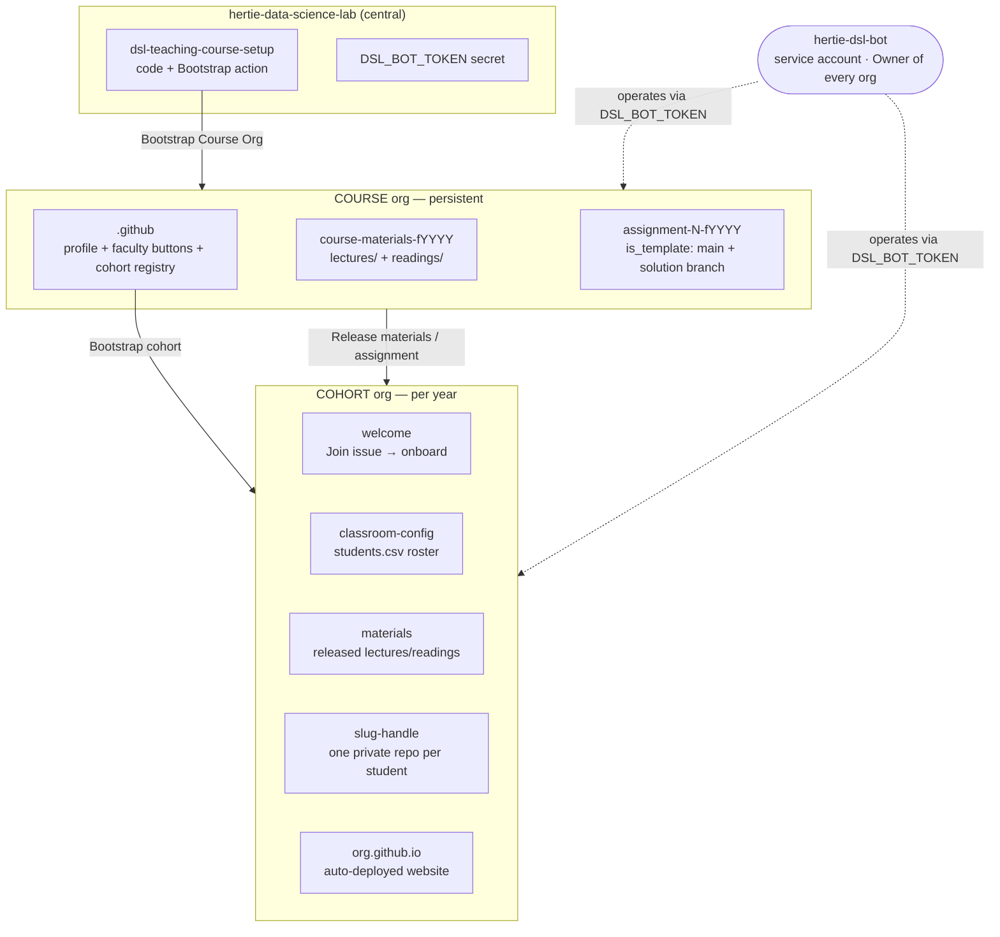
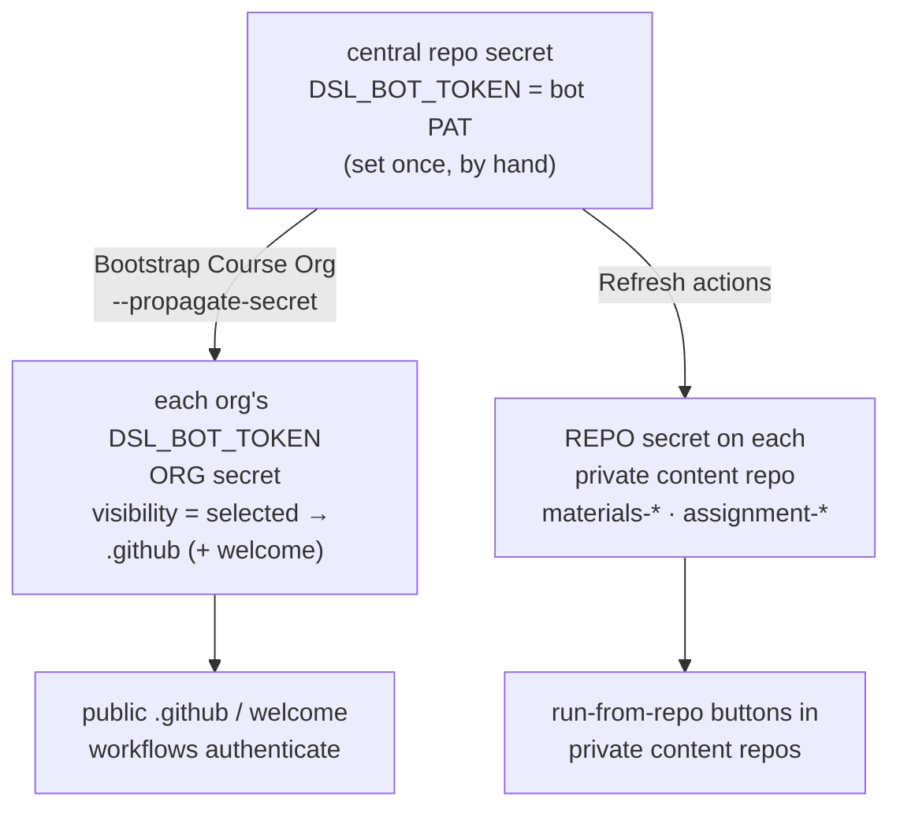
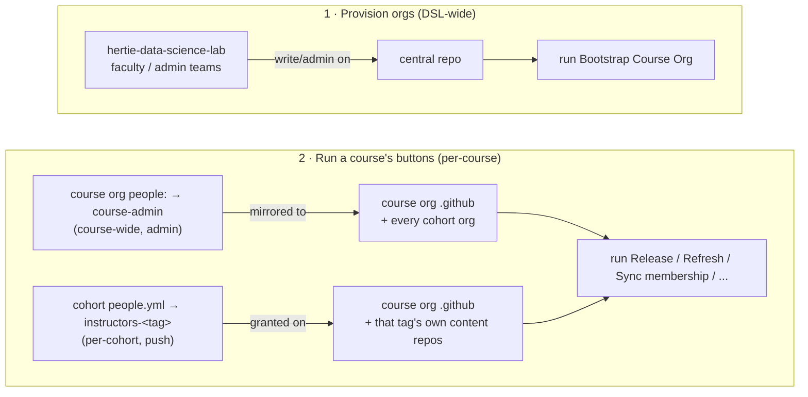
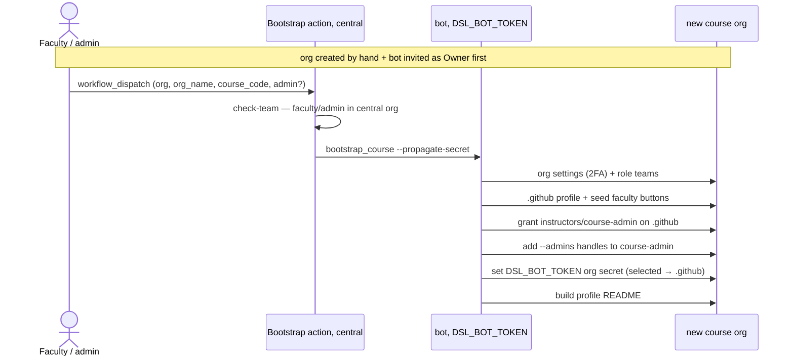
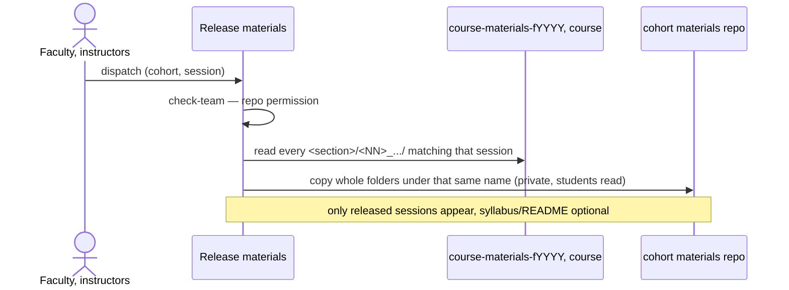
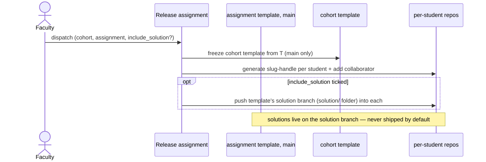
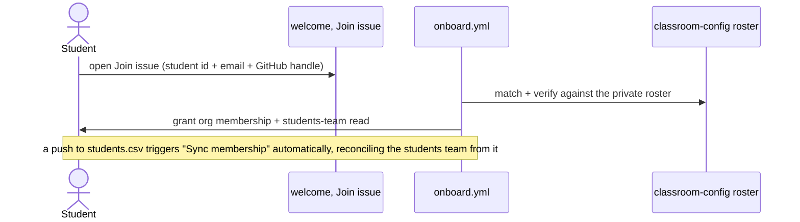
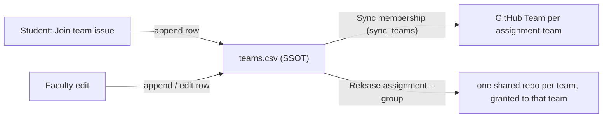
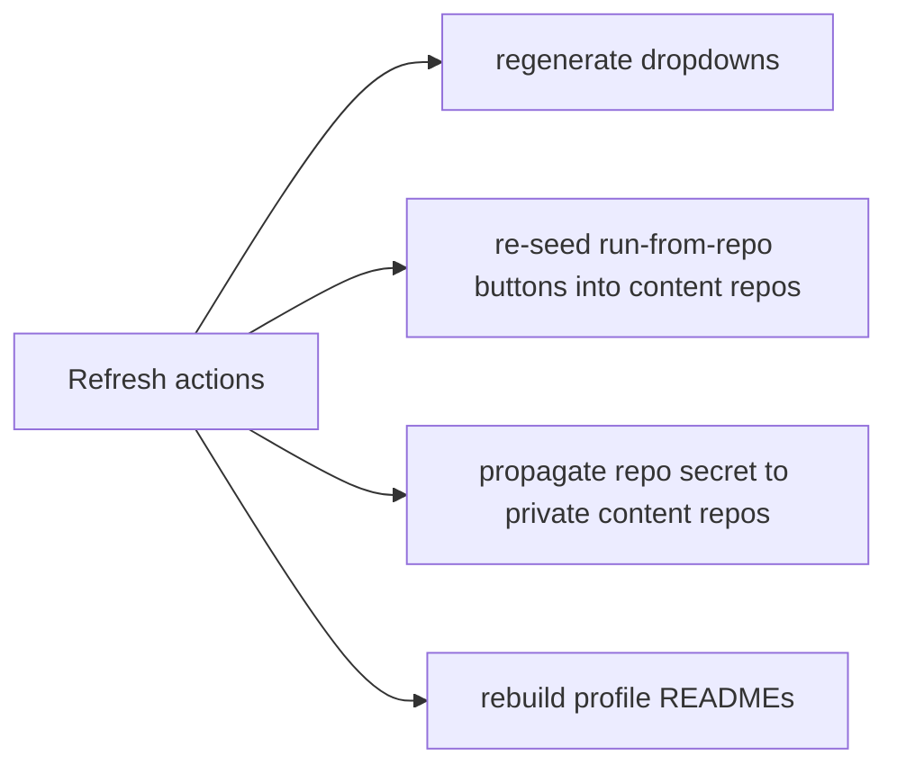
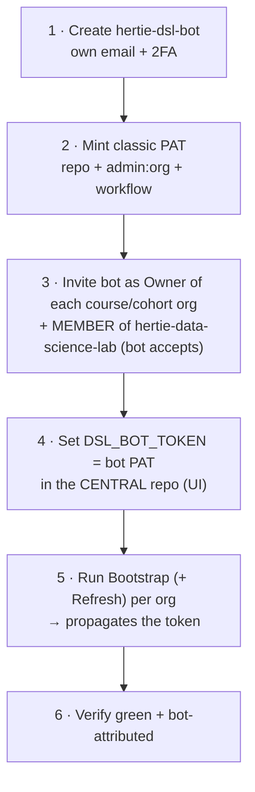

# Architecture & workflows

Admin / developer reference - **how the system is built and how the pieces move**. For the
faculty-facing overview see the [root README](../../README.md); for operational specifics (exact
PAT scopes, how to grant access) see [admin-setup.md](admin-setup.md).

- [System overview](#system-overview)
- [The bot identity](#the-bot-identity)
- [Token & secret propagation](#token--secret-propagation)
- [Access model — two populations](#access-model--two-populations)
- [Core workflows](#core-workflows)
- [Dynamic dropdowns](#dynamic-dropdowns)
- [Cohort website](#cohort-website)
- [Course website (open courseware)](#course-website-open-courseware)
- [Bot lifecycle — setup & rotation](#bot-lifecycle--setup--rotation)
- [Code map](#code-map)

## System overview

Two org tiers plus one central control repo, all operated by a single **bot** identity.
GitHub has **no org-creation API**, so each org is created by hand and the bot is invited as
Owner; everything after that is a button.

## The bot identity

Every button runs server-side under **one** credential, `DSL_BOT_TOKEN` - "the bot".
**Faculty never hold or see it**; they trigger the Actions buttons, which run as the bot.

The bot is the shared service account **`hertie-dsl-bot`** - its own email + 2FA, **Owner of
every course and cohort org**, and its classic PAT is `DSL_BOT_TOKEN`. One account, one token,
rotated centrally; nobody shares the password. Exact PAT scopes are in
[ADMIN-SETUP](admin-setup.md#the-bot-account); standing it up and rotating it is the
[Bot lifecycle](#bot-lifecycle--setup--rotation).

## Token & secret propagation

The token is set **once**, in the central repo, and the actions **fan it out** - admins never
hand-edit per-org secrets.

Why two paths, and why `selected` visibility:

- On the **GitHub Free plan, org secrets don't reach private repos** - so the private content
  repos get a **repo** secret, set by **Refresh actions**.
- An org secret with the gh-default `private` visibility doesn't reach **public** repos either
  - and `.github` / `welcome` are public. So the **org** secret is scoped
  **`visibility=selected → .github`** (plus `welcome` on cohort orgs), which reaches the
  public infra repos while keeping the org-admin token **out of** student/content repos
  (`set_org_secret`). `visibility=all` would expose it to every workflow in the org.
- On GitHub Team/Enterprise, org secrets reach private repos and this propagation is unnecessary.

## Access model — two populations

Two **separate** gates - do not conflate them.

- **Provisioning** is a DSL-wide authority: the central `faculty`/`admin` teams, granted
  write/admin on the central repo, may run **Bootstrap Course Org**. Nothing else.
- **Running a course's buttons** is **per-course**, split by role: `course_admins`
  (course-wide, admin rights, declared once on the course org and mirrored into every
  cohort's own `course-admin` team) and `instructors`/`teaching_assistants`
  (per-cohort, push rights - most cohorts have different lecturers/TAs, so each cohort
  declares its own in `classroom-config/people.yml`).
- GitHub shows "Run workflow" only to **write+** users; the seeded `check-team` re-checks repo
  permission at run time. GitHub Teams are org-scoped (no cross-org grant exists), so
  `sync_faculty` reconciles two independent flows: `course_admins` mirrors the SAME desired
  membership into the course org AND every cohort org; a cohort's own `instructors`/
  `teaching_assistants` reconcile into that cohort's own `instructors` team AND a **parallel**,
  tag-scoped `instructors-<tag>` team on the course org (push access on just that tag's content
  repos + `.github`) - no merge across cohorts, each tag gets its own team. Full detail + how to
  declare people: [ADMIN-SETUP "Who can run which action"](admin-setup.md#who-can-run-which-action).

## Core workflows

### Bootstrap a course org

A **cohort** is bootstrapped from the course org's own **Bootstrap cohort** button (not the
central action) - you give it the empty cohort org's name. It runs the same `bootstrap_course`
with `--cohort`, additionally seeding `welcome` + `classroom-config` (roster, teams, grades,
`schedule.yml`, and `people.yml` for this cohort's own instructors/TAs), tightening
permissions, scaffolding the website, applying the course's current `course_admins`, and
registering the cohort in the course's `cohort-courses-pages.yml`. Note the cohort org gets
**no `dsl-course.yml` of its own** - its `.github` repo holds only the student-facing profile
README; all of this cohort's config lives in `classroom-config`.

### Release materials

### Release assignment

### Student onboarding

### Project teams (group assignments)

Group membership follows the same CSV-is-truth pattern as enrolment. `teams.csv` (in
`classroom-config`, columns `assignment,team,github_handle`) is the **only writer surface**:
students self-select by opening a "Join team" issue (`team-formation.yml` appends a row -
authenticated author, one team per assignment, size-capped), and faculty can edit it directly.

`sync_teams` materialises a GitHub Team `<assignment>-<team>` from the CSV - **one-way and
idempotent**, so the Team is a downstream projection that can't drift. A push to `teams.csv`
triggers **Sync membership** automatically, which always fully reconciles (add AND remove -
no `--prune` toggle at that level; the CSV is the live truth). Provisioning a group assignment
grants that team its shared repo, so post-sync membership edits propagate to access and members
get @mentions + a team space. The cohort-wide `students` team and these per-project teams are
all real GitHub Teams; only the CSV is authoritative.

## Dynamic dropdowns

`workflow_dispatch` dropdowns are static YAML and can't depend on another input, so **Refresh
actions** regenerates them from live state and re-pushes the workflows (no cron, no app):

- **cohort_org** - from the `.github/cohort-courses-pages.yml` registry.
- **cohort_repo** - the cohort's content repos, with `materials` as the default.
- **session** - the source materials repo's `<section>/<NN>_.../` folders, across every
  discovered section (run-from-repo copy, with real per-section checkboxes); the central
  `.github` copy uses a free-text session + exclude field, since it can't depend on the
  chosen source repo (and so can't know its sections) until it runs.
- **source_repo** (central only) / **assignment** - the course org's content / `assignment-*` repos.

## Cohort website

Every cohort gets an **auto-deployed website** at `<cohort-org>.github.io`, generated from
`course-website-template` by `scaffold_site` during Bootstrap cohort. `site.py` then
**regenerates its content from the live org structure** on every release (and via manual
**Sync site**): the schedule lists released sessions + assignment due dates + MidTerm/Final
exams (from `classroom-config/schedule.yml`); lecture entries link the actual released files;
assignment briefs come from each template's README; instructor/TA **cards** come from the
COURSE org's declared `people:` block only (falling back to its `instructors` /
`teaching-assistants` teams if absent); the course name/semester come from the org metadata.
Note this is display-only and separate from GitHub **access**: a cohort's own
`classroom-config/people.yml` grants that cohort's instructors/TAs push access (see
[Access model](#access-model--two-populations)) but does not put them on the website - only a
course-org `people:` entry with a display `name` does that.

## Course website (open courseware)

A course can **optionally** publish a **public** site at `<course-org>.github.io` via the
manual **Publish course website** action (`site.sync_public_site`). It reuses the same
`course-website-template` + `scaffold_site`, but differs from the cohort site in one
decisive way: the cohort site *links* to files in private repos (404 for non-members, by
design), whereas the course `course-materials-*` repos are private too, so the public site
**hosts the shared files itself** under `public-materials/<source-repo>/session-N/...` (Jekyll
serves any path not starting with `_`) and links to those site-relative URLs.

- **Lectures** are always hosted; **readings** are either a text-only reading list
  (`reading-list` - citations shown, no files, copyright-safe) or hosted + linked
  (`actual-readings`). `none` skips readings.
- **Lectures + readings only** - no assignments or exam rows.
- **Opt-in + manual**: the first run scaffolds the site, later runs re-sync the chosen
  materials repo; served files are namespaced per source repo so several years coexist.
  Releases and refresh **never** touch it, so a public site only exists, and only updates,
  when faculty run the action.

## Bot lifecycle — setup & rotation

Standing up the bot, and rotating its token.

**Rotation:** mint a fresh PAT (step 2), set it in the central repo (step 4), re-run
Bootstrap + Refresh (step 5), verify (step 6), then **revoke the previous PAT last**. Set a
PAT expiry so rotation is forced.

**Hard rules** (ordering is not optional):

- **Owner before token.** The bot must be Owner of an org *before* its PAT has admin there -
  invite + accept (step 3) before propagating (step 5). GitHub has no API to force-add a
  member, so the bot's invite must be accepted once.
- **Bot must be a member of the central org.** The central Bootstrap action's `check-team`
  gate reads `hertie-data-science-lab`'s `faculty`/`admin` teams **under `DSL_BOT_TOKEN`**, so
  the bot's own account has to be a **member** of `hertie-data-science-lab` to see those
  (closed) teams - otherwise the gate 404s on the lookup and **denies everyone**. Add the bot
  as a member of the central org once (it doesn't need to be an owner there).
- **Swap central only after a one-org test.** Setting the central secret (step 4) doesn't
  touch existing org secrets - they stay until re-propagated - so it's safe; but prove it on
  one org first.
- **Never paste a token into chat, PRs, or issues.** Set it *only* via the GitHub Secrets UI.
  A token that is exposed anywhere must be **revoked and reissued** immediately.
- **When rotating, revoke the previous PAT last** - only after *every* org verifies green
  under the new one, or automation breaks mid-rotation.

## Code map

Self-contained - workflows + their Python implementation live in this repo.

- `.github/workflows/` - `bootstrap-org` (+ the legacy create-tier); the faculty workflows are
  rendered + seeded into the course/cohort orgs, not kept here.
- `dsl_course/` - the package:
  - `bootstrap_course` - configure a course or (`--cohort`) cohort org; grant button access; propagate the secret.
  - `seed` - render the workflows (central + run-from-repo), discover dropdown options, refresh.
  - `release` - publish a session's materials, across every discovered section (+ optional syllabus/README), into a cohort repo.
  - `assign` - freeze a cohort assignment template, then fan out per-student repos.
  - `scaffold` - create structured materials / assignment repos + the website (cohort or course).
  - `site` - regenerate the cohort website (`sync_site`) and the public course website (`sync_public_site`) from the live org structure.
  - `sync_roster` / `sync_teams` - reconcile the `students` team / per-project teams from
    `students.csv` / `teams.csv` (one-way: the CSV is truth, the GitHub Teams are the projection).
  - `sync_faculty` - reconcile `course-admin` team membership (course org's declared
    `people:` block - the SSOT) into the course org + every cohort's own team; and,
    per cohort, `instructors`/`teaching_assistants` (that cohort's own declared
    `classroom-config/people.yml`) into its own `instructors` team + a parallel,
    tag-scoped `instructors-<tag>` team on the course org.
  - `sync_membership` - the one consolidated entrypoint (roster + teams + faculty) that the
    seeded **Sync membership** button/cron/dispatch all call.
  - `roster` / `teams` - read the per-cohort `students.csv` / `teams.csv`.
  - `utils` - shared `gh`/git helpers with rate-limit backoff.
  - `post_migrate` / `bootstrap_org` / `list_orgs` - legacy create-tier (older course-side
    model; the next slimming target). `new_semester` (the same vintage) has been removed -
    its hardcoded `CONTENT_FOLDERS` was the exact section-name inconsistency the generic,
    dynamically-discovered sections now resolve.
- `templates/welcome/` - the cohort onboarding workflow + Join issue form.
