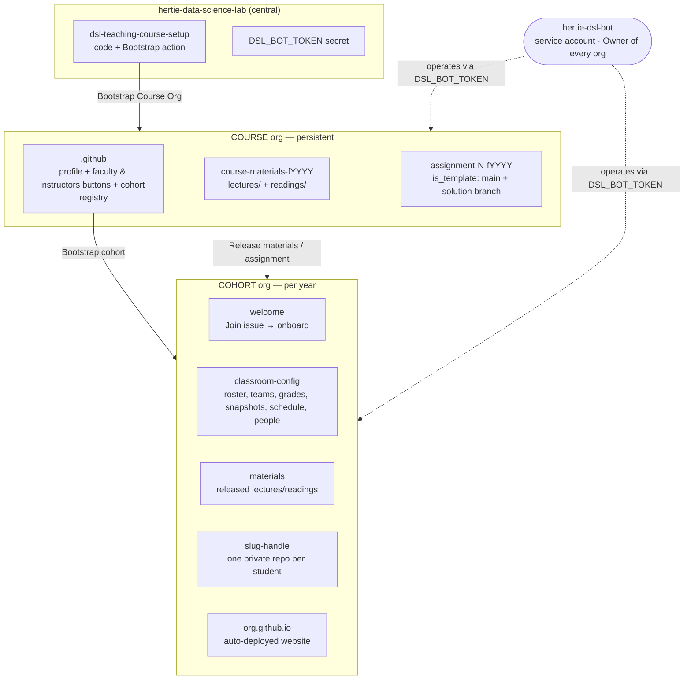
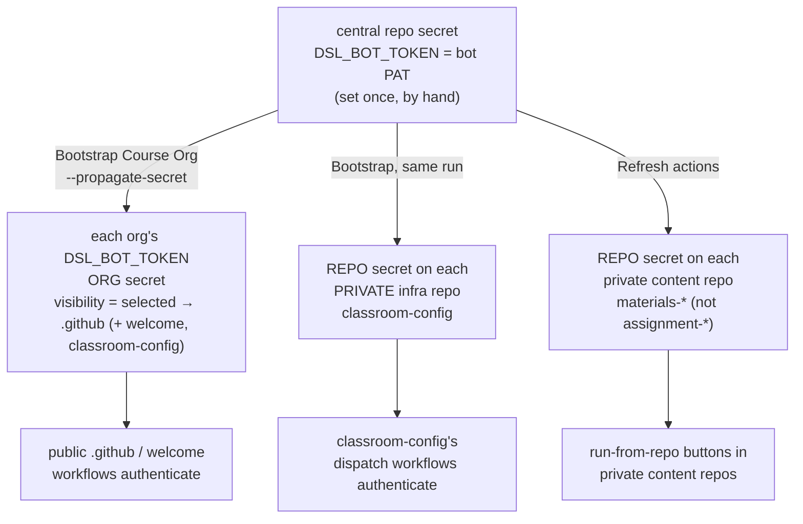
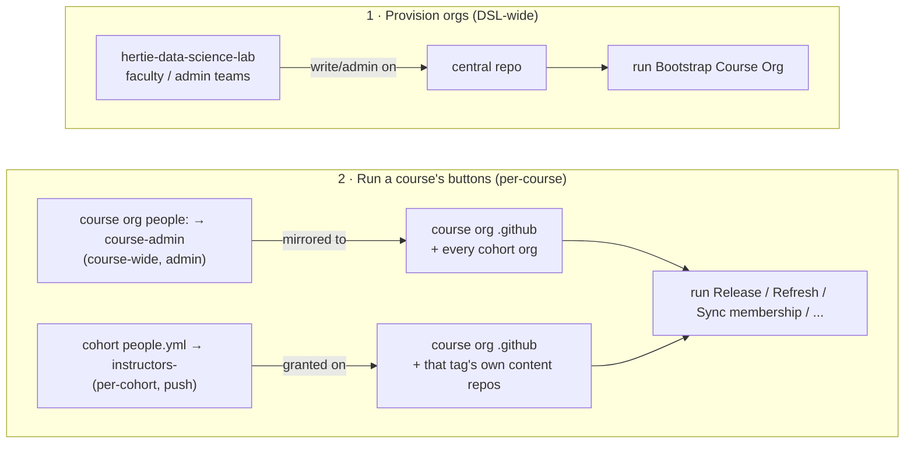
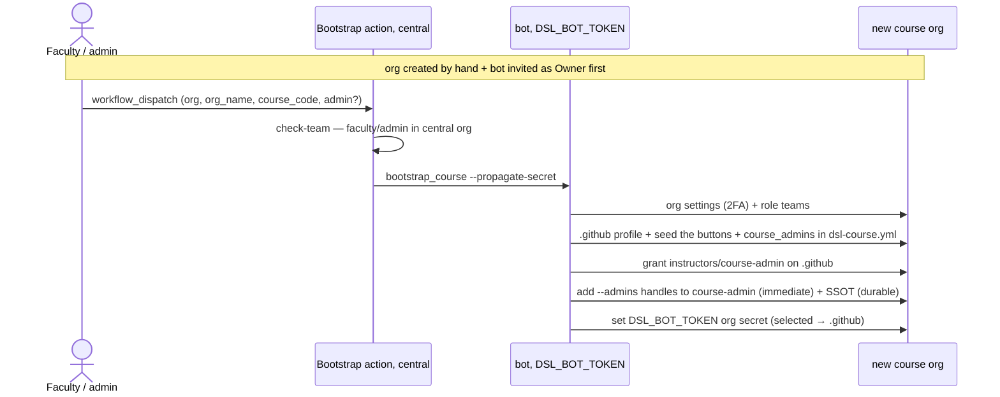
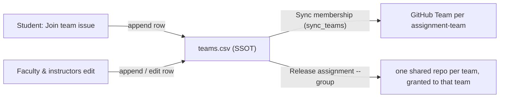

# Architecture & workflows

Admin / developer reference - **how the system is built and how the pieces move**. For the
faculty-facing overview see the [root README](../../README.md); for operational specifics (PAT
scopes, granting access) see [admin-setup.md](admin-setup.md).

**You need this doc only if you're modifying `dsl_course/`, debugging a workflow failure, or
rotating the bot.** Everything faculty do is covered by the
[runbooks](../faculty-and-instructors/README.md).

- [System overview](#system-overview)
- [The bot identity](#the-bot-identity)
- [Token & secret propagation](#token--secret-propagation)
- [Access model — two populations](#access-model--two-populations)
- [Core workflows](#core-workflows)
- [The scheduler](#the-scheduler)
- [Dynamic dropdowns](#dynamic-dropdowns)
- [Repo discovery](#repo-discovery)
- [Cohort website](#cohort-website)
- [Course website (open courseware)](#course-website-open-courseware)
- [Bot lifecycle — setup & rotation](#bot-lifecycle--setup--rotation)
- [Code map](#code-map)

## System overview

Two org tiers plus one central control repo, all operated by a single **bot** identity.
GitHub has **no org-creation API**, so each org is created by hand and the bot is invited as
Owner; everything after that is a button.

```mermaid
flowchart TB
  subgraph central["hertie-data-science-lab (central)"]
    repo["`dsl-teaching-course-setup
code + Bootstrap action`"]
    sec["DSL_BOT_TOKEN secret"]
  end
  bot(["`hertie-dsl-bot
service account · Owner of every org`"])
  subgraph course["COURSE org — persistent"]
    cg["`.github
profile + faculty & instructors buttons + cohort registry`"]
    mat["`course-materials-fYYYY
lectures/ + readings/`"]
    asg["`assignment-N-fYYYY
is_template: main + solution branch`"]
  end
  subgraph cohort["COHORT org — per year"]
    wel["`welcome
Join issue → onboard`"]
    ros["`classroom-config
roster, teams, grades, snapshots, schedule, people`"]
    cmat["`materials
released lectures/readings`"]
    stu["`slug-handle
one private repo per student`"]
    site["`org.github.io
auto-deployed website`"]
  end
  repo -->|"Bootstrap Course Org"| course
  cg -->|"Bootstrap cohort"| cohort
  course -->|"Release materials / assignment"| cohort
  bot -.->|"operates via DSL_BOT_TOKEN"| course
  bot -.->|"operates via DSL_BOT_TOKEN"| cohort
```

## The bot identity

Every button runs server-side under **one** credential, `DSL_BOT_TOKEN` - the shared service
account **`hertie-dsl-bot`**, Owner of every course and cohort org. Faculty and instructors
never hold or see it; they click buttons, which run as the bot. Which account and its exact PAT
scopes: [ADMIN-SETUP](admin-setup.md#the-bot-account). Standing it up and rotating it:
[Bot lifecycle](#bot-lifecycle--setup--rotation).

## Token & secret propagation

The token is set **once**, in the central repo, and the actions **fan it out** - admins never
hand-edit per-org secrets.

```mermaid
flowchart TD
  src["`central repo secret
DSL_BOT_TOKEN = bot PAT
(set once, by hand)`"]
  src -->|"`Bootstrap Course Org
--propagate-secret`"| orgsec["`each org's DSL_BOT_TOKEN
ORG secret
visibility = selected → .github (+ welcome, classroom-config)`"]
  src -->|"Bootstrap, same run"| infrasec["`REPO secret on each
PRIVATE infra repo
classroom-config`"]
  src -->|"Refresh actions"| reposec["`REPO secret on each
private content repo
materials-* (not assignment-*)`"]
  orgsec --> pub["`public .github / welcome
workflows authenticate`"]
  infrasec --> disp["`classroom-config's
dispatch workflows authenticate`"]
  reposec --> priv["`run-from-repo buttons in
private content repos`"]
```

Why three paths, and why `selected` visibility:

- On the **GitHub Free plan, org secrets don't reach private repos** - so the private content
  repos get a **repo** secret, set by **Refresh actions**. `assignment-*` templates deliberately
  get none: they host no run-from-repo buttons (`discover_content_repos` excludes them), and a
  secret on a template would propagate into every generated student repo.
- The same gap hits the private **infra** repo `classroom-config`, whose dispatch workflows (a
  push to `students.csv`/`teams.csv`/`schedule.yml` fires **Sync membership** / **Sync site**
  cross-org) also run under `DSL_BOT_TOKEN`. Refresh only ever touches *content* repos, so
  **Bootstrap** mirrors the token as a **repo** secret onto each private infra repo in the same
  run that sets the org secret (`bootstrap_course.set_org_secret`) - that is the only path the
  token reaches `classroom-config`.
- An org secret with the gh-default `private` visibility doesn't reach **public** repos either,
  and `.github` / `welcome` are public. So the **org** secret is scoped
  **`visibility=selected → .github`** (plus `welcome` + `classroom-config` on cohort orgs, each
  scoped only if it exists), which reaches the public
  infra repos while keeping the org-admin token **out of** student/content repos.
  `visibility=all` would expose it to every workflow in the org.
- On GitHub Team/Enterprise, org secrets reach private repos and this propagation is unnecessary.

## Access model — two populations

Two **separate** gates - do not conflate them.

```mermaid
flowchart TD
  subgraph prov["1 · Provision orgs (DSL-wide)"]
    ct["`hertie-data-science-lab
faculty / admin teams`"] -->|"write/admin on"| cr["central repo"] --> ba["run Bootstrap Course Org"]
  end
  subgraph run["2 · Run a course's buttons (per-course)"]
    ca["`course org people: → course-admin
(course-wide, admin)`"] -->|"mirrored to"| gh["`course org .github
+ every cohort org`"]
    it["`cohort people.yml → instructors-<tag>
(per-cohort, push)`"] -->|"granted on"| ghtag["`course org .github
+ that tag's own content repos`"]
    gh --> rb["run Release / Refresh / Sync membership / ..."]
    ghtag --> rb
  end
  prov ~~~ run
```

- **Provisioning** is a DSL-wide authority: the central `faculty`/`admin` teams, granted
  write/admin on the central repo, may run **Bootstrap Course Org**. Nothing else.
- **Running a course's buttons** is **per-course**: `course_admins` (course-wide admin) and each
  cohort's own `instructors`/`teaching_assistants` (per-cohort push).
- GitHub shows "Run workflow" only to **write+** users, and the seeded `check-team` job re-checks
  repo permission at run time. Teams are org-scoped (no cross-org grant exists), so `sync_faculty`
  runs two independent flows: `course_admins` mirrors the same desired membership into the course
  org AND every cohort; each cohort's people.yml reconciles into that cohort's `instructors` team
  AND a **parallel**, tag-scoped `instructors-<tag>` team on the course org - no merge across
  cohorts. Who-to-declare-where:
  [ADMIN-SETUP](admin-setup.md#who-can-run-which-action).

Cohort-side, students land on `students` or `auditors` per their roster `role`. Both get read on
released materials; only `students` gets assignment repos and a gradebook.

## Core workflows

### Bootstrap a course org

```mermaid
sequenceDiagram
  actor F as Faculty / admin
  participant A as Bootstrap action, central
  participant Bot as bot, DSL_BOT_TOKEN
  participant Org as new course org
  Note over F,Org: org created by hand + bot invited as Owner first
  F->>A: workflow_dispatch (org, org_name, course_code, admin?)
  A->>A: check-team — faculty/admin in central org
  A->>Bot: bootstrap_course --propagate-secret
  Bot->>Org: org settings (2FA) + role teams
  Bot->>Org: .github profile + seed the buttons + course_admins in dsl-course.yml
  Bot->>Org: grant instructors/course-admin on .github
  Bot->>Org: add --admins handles to course-admin (immediate) + SSOT (durable)
  Bot->>Org: set DSL_BOT_TOKEN org secret (selected → .github)
```

`--admins` both invites those handles to `course-admin` directly (so they have access before
any sync runs) AND seeds them into `dsl-course.yml`'s `people.course_admins` - the single source
of truth (SSOT) `sync_faculty` reconciles against. **Anything not in the SSOT gets pruned by the next sync**,
so an admin added via the Teams UI or a one-off `gh api` call must also be declared in
`dsl-course.yml`.

A **cohort** is bootstrapped from the course org's own **Bootstrap cohort** button (not the
central action), given the empty cohort org's name. It runs the same `bootstrap_course` with
`--cohort`: seeds `welcome` + `classroom-config` (roster, teams, grades, `schedule.yml`,
`people.yml`), creates the `students` + `auditors` teams, tightens permissions, scaffolds the
website, applies the course's current `course_admins`, registers the cohort in the course's
`cohort-courses-pages.yml`, and writes a small `.github/dsl-course.yml` **pointer** (`course:`,
`org:`) so the cohort-side dispatchers know which course org to fire at. All of this cohort's
real config lives in `classroom-config`.

### Release

**Materials** copies whole `<section>/<NN>_.../` folders for the chosen sessions from the course
org into a cohort repo - private, with read for both the `students` and `auditors` teams. Only
released sessions exist cohort-side; everything is idempotent, so re-releasing is a no-op.

**Assignment** is two stages: freeze a cohort-level template from the course template's `main`
(so a mid-term edit to the course template can't change what a cohort was handed), then generate
one private `<slug>-<handle>` repo per onboarded, **enrolled** student from that frozen copy.
Solutions live on the template's `solution` branch and are never shipped unless
`include_solution` is ticked. Whether a release fans out per student or per team is the
workflow's `group` checkbox - not anything in `grading.yml`, whose `type:` only serves as the
autograder's fallback.

**Code** (`release_code`, rendered by `workflows_render.render_release_code`) copies one path -
a subpackage folder or a single module - from the repo it is run in into a cohort repo, purely
additively, so a package can be disclosed topic by topic. It is **never seeded centrally**
(`seed_github_workflows` has no entry for it): the workflow is pushed only into content repos by
`_push_workflows`, because the source repo is always the repo you run it from.

Materials and Assignment are exposed centrally (in `.github`) *and* run-from-repo (in each
content repo), from the same renderer; the run-from-repo copy drops `source_repo` and knows that
repo's own sections. All three are the **fallback path** - the schedule
(`materials_releases` in `schedule.yml`) is the primary release mechanism; the manual release
buttons are for demos, one-offs, and recovery.

### Student onboarding

```mermaid
sequenceDiagram
  actor St as Student
  participant W as welcome, Join issue
  participant O as onboard.yml
  participant R as classroom-config roster
  St->>W: open Join issue, paste the emailed enrol_code
  O->>R: match the code; record issue-author handle + immutable github_id
  O->>St: org membership + students (or auditors) team read
  Note over O,St: a push to students.csv triggers "Sync membership", reconciling both teams
```

The enrolment code is random and carries no personal data, so nothing in the public issue needs
redacting; it is unguessable and single-use, so a classmate cannot bind someone else's roster
row to their account. The handle comes from the issue **author**, so it cannot be spoofed.

### Project teams (group assignments)

`teams.csv` (in `classroom-config`, columns `assignment,team,github_handle`) is the **only
writer surface**: students self-select by opening a "Join team" issue (`team-formation.yml`
appends a row - authenticated author, one team per assignment, size-capped, auditors refused),
and faculty can edit it directly. The cap is **5**, set by `MAX_TEAM_SIZE` in
`templates/welcome/team-formation.yml` (edit there, then re-seed the cohort's `welcome` repo).

```mermaid
flowchart LR
  St["Student: Join team issue"] -->|"append row"| CSV["teams.csv (SSOT)"]
  Fac["Faculty & instructors edit"] -->|"append / edit row"| CSV
  CSV -->|"Sync membership (sync_teams)"| GT["GitHub Team per assignment-team"]
  CSV -->|"Release assignment --group"| RP["one shared repo per team, granted to that team"]
```

`sync_teams` materialises a GitHub Team `<assignment>-<team>` from the CSV - **one-way and
idempotent**, so the Team is a downstream projection that can't drift. A push to `teams.csv`
triggers **Sync membership**, which always fully reconciles (add AND remove - the CSV is the
live truth).

## The scheduler

The intended operating mode: fill a cohort's `classroom-config/schedule.yml` once and the
hourly **Scheduled release** cron runs the term. It calls the *same* idempotent functions the
manual buttons do, so re-running a *release* is a no-op and there is no "already released" state
to track. Grading is the exception: it must not repeat, so its state lives in the artefacts it
writes (`snapshots/<slug>.csv`, `autograde/<slug>/`) rather than in the scheduler.
Manual `workflow_dispatch` runs default to `dry_run=true`; the cron passes no inputs and so
releases for real. It is the one org-level workflow with no `check-team` gate - a scheduled run
has no actor. A course org with **no registered cohorts** is a quiet no-op: `scheduler.main()`
logs a skip and exits 0, so the hourly run stays green - the normal state between bootstrapping
the course org (which installs the cron) and bootstrapping its first cohort.

Each hourly tick:

1. **Freezes passed deadlines** - for every assignment in `assignments:` whose grading deadline
   (`grading_deadline`, else `due`) has passed and has no snapshot yet, records the
   commit each submission repo is at into `classroom-config/snapshots/<slug>.csv`
   (`repo,sha,recorded_at`).
2. **Autogrades those same assignments, once each** - template `<slug>-<tag>` in the course org,
   skipped gracefully when there is no such repo, no `solution` branch, or `autograde: false`.
   The fire-once marker is the `autograde/<slug>/` results directory: present means graded, so
   never again (a re-grade means deleting it). No `grade:` entry is needed.
3. **Fires every action whose time has arrived** (a deploy's `deploy_datetime`, else its
   entry's `calendar_event`) - `deploy` (copy a course-org path into a cohort repo),
   `assignment` (provision student repos - per team when the template's grading.yml says
   `type: group`). An entry with no actions is a display-only calendar event for the site.

Phases 1-2 run before the releases and run whether or not the cohort uses `materials_releases`
at all.

**Why snapshots.** A git committer date is entirely client-supplied (`GIT_COMMITTER_DATE`), so
the old `git rev-list --before` pin could be defeated by backdating a late commit. The snapshot
is recorded at a time the **server** chose and `snapshot_assignment` refuses to overwrite an
existing file, so a later push cannot move the pin. Grading pins to the recorded sha; a blank
sha means nothing was pushed by the deadline and scores zero; **no** snapshot file at all falls
back to the date-based pin with a loud warning. Honest limitation: a post-deadline push carrying
a spoofed pre-deadline date, landing before the first tick, is still captured - the backdating
window shrinks from unlimited to ≤1h, it does not close. Deleting the CSV lets the next tick
re-freeze deliberately.

## Dynamic dropdowns

`workflow_dispatch` dropdowns are static YAML and can't depend on another input, so **Refresh
actions** regenerates them from live state and re-pushes the workflows (no cron, no app) - the
same run re-seeds the run-from-repo buttons, propagates the repo secret, and rebuilds the profile
READMEs.

- **cohort_org** - from the `.github/cohort-courses-pages.yml` registry.
- **source_repo** (central only) / **assignment** - the course org's content / `assignment-*` repos.
- **sessions** - free text, comma and/or hyphen-range (`1,3,5-7`): there is no multi-select
  widget, and a checkbox per session would blow the input cap. The run-from-repo copy lists the
  discovered sessions in the field description.
- **release_&lt;section&gt; / &lt;section&gt;_path** - a checkbox (default on) + a free-text path
  field per section, capped at `MAX_RELEASE_SECTIONS` (3). The cap is *derived*, not chosen:
  `workflow_dispatch` allows 10 inputs and each section costs 2, alongside
  cohort_org/sessions/include_root_files and (centrally) source_repo - the arithmetic lives in
  `release_budget.py`. A blank path creates/uses a repo named after the section at its root;
  `repo/subpath` nests it, so sections can share a repo. Sections beyond the cap are logged by
  `cap_sections`, not silently dropped, and can be released with
  `python3 -m dsl_course.release --destinations`. The run-from-repo copy uses that repo's own
  sections; the central copy uses the union across the org, since it can't know which source repo
  you'll pick.

## Repo discovery

One predicate, `discovery._is_infra_repo`, keeps infrastructure out of **both** orgs' dropdowns
and scans - so a repo type added on one side can't leak into the other. It excludes:

- names in `INFRA_REPOS` = `welcome`, `classroom-config`, `.github`;
- anything ending `.github.io` (the generated site repos - critical, since content repos are
  handed the org-admin token as a repo secret and would publish it to a public repo);
- any repo carrying a topic in `INFRA_TOPICS` = `submission`, `assignment-template`, `gradebook`
  (per-student submission repos, frozen cohort-side templates, private `grades-<handle>` repos).

On top of that, `discover_content_repos` also drops `assignment-*` (equipping a template with
the faculty workflows would copy them into every generated student repo), and
`discover_assignments` is the inverse: `assignment-*` that are `isTemplate`. Listing is
paginated (`orgs/<org>/repos?per_page=100`), because a cohort org holds a repo per student per
assignment plus a gradebook each.

## Cohort website

Every cohort gets an **auto-deployed website** at `<cohort-org>.github.io`, generated from
`course-website-template` by `scaffold_site` during Bootstrap cohort. `site.py` then
regenerates its content from the live org structure on every release, on a push to
`classroom-config/schedule.yml` (via a `repository_dispatch` from that repo), on a daily cron,
and on manual **Sync site**. The schedule lists released sessions + assignment due dates +
exams (from `schedule.yml`); lecture entries link the actual released files; assignment briefs
come from each template's README; instructor/TA **cards** come from that cohort's own
`classroom-config/people.yml` (falling back to the cohort org's `instructors` team); the course
name/semester come from the org metadata.

A push to `people.yml` fires no dispatch, so a card edit lands via the daily cron or a manual
**Sync site**.

## Course website (open courseware)

A course can **optionally** publish a **public** site at `<course-org>.github.io` via the
**Publish course website** action (`site.sync_public_site`). It reuses the same
`course-website-template` + `scaffold_site`, but differs from the cohort site in one decisive
way: the cohort site *links* to files in private repos (404 for non-members, by design),
whereas the course `course-materials-*` repos are private too, so the public site **hosts the
shared files itself** under `public-materials/<source-repo>/session-N/...` (Jekyll serves any
path not starting with `_`) and links to those site-relative URLs.

- **Lectures** are always hosted; **readings** are either a text-only reading list
  (`reading-list` - citations, no files, copyright-safe) or hosted + linked
  (`actual-readings`). `none` skips readings. Lectures + readings only - no assignments, no
  exam rows.
- **Opt-in, then automatic.** The first run scaffolds the site; every run records its settings
  in `_publish-config.yml` at the site root (`_`-prefixed so Jekyll ignores it) and a daily cron
  re-syncs from them, so materials edits reach the public site without another click. **Delete
  `_publish-config.yml` to stop the automatic refresh.** The cron is a no-op wherever nobody has
  published, and releases/refresh never touch it - a public site exists only once someone runs
  the action.

## Bot lifecycle — setup & rotation

Standing the bot up, minting and rotating its PAT, and the ordering rules that make rotation
safe (Owner before token, central-org membership, revoke the old PAT last) live in
**[central-admin.md](central-admin.md#bot-lifecycle---setup--rotation)**.

Architecturally, all you need here: one credential, `DSL_BOT_TOKEN`, is set by hand in the
central repo and fanned out by Bootstrap/Refresh - see
[Token & secret propagation](#token--secret-propagation).

## Code map

Self-contained - workflows and their Python implementation both live in this repo.

- `.github/workflows/` - `bootstrap-org` (the one central button) + `refresh-inventory`
  (weekly cron regenerating `inventory/course-orgs.md`) + `ci`. The faculty workflows are
  *rendered* and seeded into the course/cohort orgs, not kept here.
- `dsl_course/`:
  - `bootstrap_course` - configure a course or (`--cohort`) cohort org; create teams; grant
    button access on `.github` and, cohort-side, on the infra repos faculty actually work in
    (`grant_cohort_faculty_access` / `COHORT_FACULTY_REPOS` = `welcome`, `classroom-config`, so
    non-owner instructors get write and course-admin gets admin under
    `default_repository_permission=none`); propagate the secret.
  - `seed` - place the workflows (central + run-from-repo) and the `refresh` CLI; it delegates
    to four modules and re-exports a few of their names (see `__all__`; new code imports from
    the owner):
    - `workflows_render` - the workflow YAML templates + every `render_*` function;
    - `discovery` - the cohort registry and all live org/repo/section/session discovery,
      including the shared infra-repo predicate;
    - `profile_readme` - the org landing page + the `.github` repo's own README;
    - `release_budget` - the 10-input cap and the section-slot arithmetic under it.
  - `scheduler` - the hourly cron: freeze passed deadlines, then fire due releases.
  - `schedule` - parse `schedule.yml` (timezone-aware releases, due dates, exams).
  - `release` / `release_code` - publish a session's materials across every discovered section
    into a cohort repo / copy one package path additively.
  - `assign` - freeze a cohort assignment template, then fan out per-student (or per-team) repos.
  - `collect` - the faculty-side autograder: deadline snapshots, pinned checkout, sandboxed test
    run, `auto` scores into the grade CSV.
  - `grades` - gradebook repos (`sync`), the preview PR (`render`), fan-out + email (`distribute`).
  - `enrol_codes` / `mailer` - generate + email enrolment codes; Graph or SMTP transport.
  - `scaffold` - create structured materials / assignment repos + the website (cohort or course).
  - `site` - regenerate the cohort website (`sync_site`) and the public course website
    (`sync_public_site` / `resync_public_site`).
  - `sync_roster` / `sync_teams` - reconcile the `students`+`auditors` teams / per-project teams
    from `students.csv` / `teams.csv` (one-way: the CSV is truth).
  - `sync_faculty` - reconcile `course-admin` from the course org's `people:` SSOT into the
    course org + every cohort; and, per cohort, its own `people.yml` into that cohort's
    `instructors` team + a tag-scoped `instructors-<tag>` team on the course org.
  - `sync_membership` - the one consolidated entrypoint (roster + teams + faculty) behind the
    **Sync membership** button/cron/dispatch.
  - `roster` / `teams` - read `students.csv` / `teams.csv`.
  - `status` - the **Show status** per-cohort checklist.
  - `list_orgs` - enumerate DSL course orgs by topic; drives `refresh-inventory.yml`.
  - `utils` - shared `gh`/git helpers with rate-limit backoff.
- `templates/` - the files bootstrap seeds into a fresh org, verbatim from disk
  (`bootstrap_course._template`), one subdirectory per destination:
  - `welcome/` - the cohort onboarding + team-formation workflows and their issue forms.
  - `classroom-config/` - that repo's starter roster, README contract, tag-rendered
    `schedule.yml` / `people.yml` scaffolds, the `*.csv.sample` worked examples
    (roster, teams, grades), and its two dispatch workflows.
  - `course/` - the course org's `.github/dsl-course.yml` (identity + the `people:` block,
    assembled from the `people-*.yml` fragments).
  - `cohort/` - a cohort org's `.github/dsl-course.yml` pointer back to its course org.
