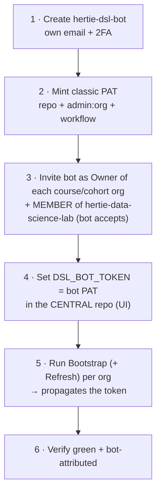

# Central admin - the DSL org

The central `hertie-data-science-lab` authority: who may provision course orgs at all, the bot
account's lifecycle and rotation, and where to see which orgs exist. Per-course access lives in
[course-admin.md](course-admin.md); the bot's PAT scopes and the token model are in
[admin-setup.md](admin-setup.md).

## Granting a new faculty member access (manual, and the gate on everything central)

There is no config file for this. **Someone already in `hertie-data-science-lab` adds the new
person to its `faculty` (or `admin`) team via the GitHub Teams UI** - that is the only way in,
and it gates every central button.

- **Bootstrap Course Org** checks membership of those two teams (`bootstrap-org.yml`
  `check-team`). No membership, no org provisioning.
- The "write to see the button" rule applies here too, so as a **one-time setup** the central
  `dsl-teaching-course-setup` repo grants **`faculty` → write** and **`admin` → admin**, and its
  `main` is **branch-protected** (require a PR) so that write can't push to `main` directly.
  Without the repo grant, team membership alone wouldn't surface the button - only org owners
  would see it.
- This authority is DSL-wide and *creation-only*: it gates configuring any course org and
  nothing else. It grants **no** access to any course's own buttons - those come from that
  course org's `course-admin` / `instructors-<tag>` teams
  ([course-admin.md](course-admin.md)). Central members are deliberately not mirrored into
  course orgs.

## Bot lifecycle - setup & rotation

Every org holds its **own copy** of the bot's PAT (as an org secret, plus repo secrets on
private repos on the Free plan), so "rotate the token" is a per-org operation, not one edit.

**Rotation:** mint a fresh PAT (2), set it in the central repo (4), re-run Bootstrap + Refresh
(5) **for every org** - a central edit alone changes nothing out there - verify (6), then
**revoke the previous PAT last**, only after *every* org verifies green under the new one. Set a
PAT expiry so rotation is forced.

**Hard rules** (ordering is not optional):

- **Owner before token.** The bot must be Owner of an org *before* its PAT has admin there -
  invite + accept (3) before propagating (5). GitHub has no API to force-add a member.
- **The bot must be a member of the central org.** Bootstrap's `check-team` gate reads
  `hertie-data-science-lab`'s (closed) `faculty`/`admin` teams **under `DSL_BOT_TOKEN`**, so
  without that membership the lookup 404s and the gate **denies everyone**. Member is enough;
  it needn't be an owner there.
- **Swap central only after a one-org test.** Setting the central secret (4) doesn't touch
  existing org secrets - they stay until re-propagated - so it's safe, but prove it on one org.
- **Never paste a token into chat, PRs, or issues.** Set it *only* via the Secrets UI; a token
  exposed anywhere must be **revoked and reissued** immediately.

## Before bootstrapping a new org

The org itself is created by hand in the GitHub web UI (there is no org-creation API), and the
bot must be **invited as an Owner and have accepted** that invite before Bootstrap runs against
it - an unaccepted invite leaves the token without admin there and the run fails. Same for the
cohort orgs. The walkthroughs are runbooks
[01-new-course-org.md](../faculty-and-instructors/01-new-course-org.md) and
[04-new-cohort-org.md](../faculty-and-instructors/04-new-cohort-org.md).

## What orgs exist

**[`inventory/course-orgs.md`](../../inventory/course-orgs.md)** is the live list. It is
auto-generated: `refresh-inventory.yml` runs **Mondays 06:00 UTC** (and on demand), discovers
course orgs by the `dsl-course-hub` topic that bootstrap sets on each `.github` repo, and opens
a PR when the list changed. Nothing is hand-maintained, so a missing org means a failed or
never-run bootstrap - not a forgotten edit.

## Related

- [admin-setup.md](admin-setup.md) - the bot account, exact PAT scopes, token/secret model.
- [course-admin.md](course-admin.md) - per-course access and the instructors teams.
- [architecture.md](architecture.md) - diagrams, workflow sequences, code map.
