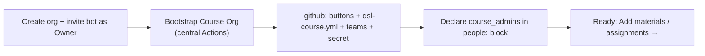

# New course org (one-time setup)

Stand up the **persistent** control plane for a course: its teams, the faculty & instructors console
(`.github` with all the buttons), and its identity card. Do this **once** per course - it
serves every future cohort (year). Per-year setup is [New cohort org](04-new-cohort-org.md).

## Prerequisites

- **You are in the `faculty` (or `admin`) team of [`hertie-data-science-lab`](https://github.com/orgs/hertie-data-science-lab/teams)** - this gates the *Bootstrap Course Org* button. 

## Steps

1. **Create the org** in the GitHub web UI: **[github.com/account/organizations/new (Free plan)](https://github.com/account/organizations/new?plan=free&ref_cta=Create%2520a%2520free%2520organization&ref_loc=cards&ref_page=%2Forganizations%2Fplan)**
   → *Create a new organization*. Naming convention: **`<course-name>-<CODE>`**
   (e.g. `DSL-Demo-Course-E1234`). The org is persistent, so the name carries **no year**.

2. **Invite `hertie-dsl-bot` as Owner** of the org you just made: go to
   **`https://github.com/orgs/<your-org>/people`** (Org → People) → *Invite member* →
   `hertie-dsl-bot` → role **Owner**.

   > ⚠️ **The bot must accept the invite before you can bootstrap.** `hertie-dsl-bot` is a
   > shared DSL account - ask the DSL team (h.baker) to accept the pending org invite.
   > Until they do, the org has no bot Owner and the *Bootstrap Course Org* run will fail.

3. **Run [Bootstrap Course Org](https://github.com/hertie-data-science-lab/dsl-teaching-course-setup/actions/workflows/bootstrap-org.yml)** 
   (central DSL repo → Actions → *Run workflow*):

   | Input | Value | Notes |
   |-------|-------|-------|
   | `org` | the org you just made | e.g. `DSL-Demo-Course-E1234` |
   | `org_name` | display name | e.g. `DSL Demo Course` |
   | `course_code` | short code | e.g. `E1234` |
   | `set_secret` | `true` (default) | propagates `DSL_BOT_TOKEN` to the org - **don't set the secret by hand** |
   | `admin` | *your handle* | adds you to `course-admin` so you can run the course buttons (see step 5) |

   This creates everything below ([What it creates](#what-it-creates)) and is idempotent -
   safe to re-run.

4. **Confirm admin access in the course org.** Membership is **not** automatic. If you
   passed handle(s) as `admin` in step 3 they're added to `course-admin` (course-wide, admin
   rights) **and** declared in `.github/dsl-course.yml`'s `people.course_admins` (so a later
   sync keeps them). Otherwise declare `course_admins` in that block (step 5) and run
   **Sync membership** - or, for a one-off, an org owner adds you via the Teams page directly.

   > ⚠️ **Each admin handle gets an org invite that stays `pending` until that person
   > accepts.** You (your own handle) accept your own invite; a co-admin (e.g. a colleague)
   > must accept theirs before they show as a member or can run the buttons - they look
   > "not added" until then. GitHub's member list only shows *accepted* members, so check
   > *People → Pending invitations* if someone seems missing.

   **TAs/co-instructors are not granted access here** - most cohorts have different
   lecturers/TAs, so each cohort declares its own in `classroom-config/people.yml` once you
   [bootstrap that cohort](04-new-cohort-org.md). (The course-org `dsl-course.yml` *does*
   carry an optional `instructors` / `teaching_assistants` block, but that is **display-only**
   website-card data - it grants no access.)

5. *(optional)* **Adjust the identity card.** Bootstrap writes `.github/dsl-course.yml` from
   your inputs: course identity, your `course_admins` (live if you passed `admin`, otherwise a
   commented template), and a commented **website-card** scaffold for `instructors` /
   `teaching_assistants` (name/photo/title/link shown on the course + cohort sites - no
   access). Uncomment the cards to show your teaching team on the websites. If you edit the
   file (web UI → commit to `main`), run **Refresh actions** to rebuild the profile README.

## What it creates

In the org's **`.github`** repo (public):

- **All faculty & instructors buttons** in the Actions tab (New materials/assignment, Refresh, Bootstrap
  cohort, Release, Sync, Grade, …) - seeded from the [central toolkit](https://github.com/hertie-data-science-lab/dsl-teaching-course-setup).
- **`dsl-course.yml`** - the identity card (editable).
- **`README.md`** - an orientation page (editable/deletable - you're reading the long-form version of it here).
- **`profile/README.md`** - the org landing page (auto-generated; don't hand-edit).

Plus, org-wide: the **`instructors` / `course-admin` teams** (`course-admin` → admin on
`.github`, reconciled from this org's `people:` block - `instructors` is created but left
unreconciled, since instructors are now declared per cohort; see
[ARCHITECTURE → Access model](../admin/architecture.md#access-model--two-populations)),
**2FA enforcement**, and the **`DSL_BOT_TOKEN`** org secret (scoped to `.github`).

## Next

- [Add materials](02-add-materials-to-course.md) and [Add assignment](03-add-assignment-to-course.md) to the course org.
- When the year starts: [New cohort org](04-new-cohort-org.md).

---
**Demo:** course org [`DSL-Demo-Course-E1234`](https://github.com/DSL-Demo-Course-E1234) ·
console [`.github` Actions](https://github.com/DSL-Demo-Course-E1234/.github/actions).
