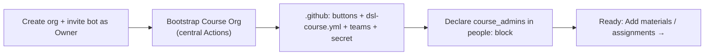

# New course org (one-time setup)

Stand up the **persistent** control panel for a course: its teams, the faculty & instructors
buttons (`.github` with all the actions), and its identity card. Do this **once** per course - it
serves every future cohort (year). Per-year setup is [New cohort org](04-new-cohort-org.md).

## Prerequisites

- **You are in the `faculty` (or `admin`) team of [`hertie-data-science-lab`](https://github.com/orgs/hertie-data-science-lab/teams)** - this gates the *Bootstrap Course Org* button. 

## Steps

1. **Create the org** in the GitHub web UI: **[github.com/account/organizations/new (Free plan)](https://github.com/account/organizations/new?plan=free&ref_cta=Create%2520a%2520free%2520organization&ref_loc=cards&ref_page=%2Forganizations%2Fplan)**
   → *Create a new organization*. Naming convention: **`<course-name>-<CODE>`**
   (e.g. `DSL-Demo-Course-E1234`). The org is persistent, so the name carries **no year**.

2. **Invite `hertie-dsl-bot` as Owner** of the org you just made: go to
   **`https://github.com/orgs/<your-org>/people`** (Org → People) → *Invite member* →
   `hertie-dsl-bot` → role **Owner**.

   > ⚠️ **The bot must accept the invite before you can bootstrap.** `hertie-dsl-bot` is a
   > shared DSL account - ask the DSL team (h.baker) to accept the pending org invite.
   > Until they do, the org has no bot Owner and the *Bootstrap Course Org* run will fail.

3. **Run [Bootstrap Course Org](https://github.com/hertie-data-science-lab/dsl-teaching-course-setup/actions/workflows/bootstrap-org.yml)** 
   (central DSL repo → Actions → *Run workflow*):

   | Input | Value | Notes |
   |-------|-------|-------|
   | `org` | the org you just made | e.g. `DSL-Demo-Course-E1234` |
   | `org_name` | display name | e.g. `DSL Demo Course` |
   | `course_code` | short code | e.g. `E1234` |
   | `set_secret` | `true` (default) | propagates `DSL_BOT_TOKEN` to the org - **don't set the secret by hand** |
   | `admin` | *your handle* | adds you to `course-admin` so you can run the course buttons (see step 5) |

   This creates everything below ([What it creates](#what-it-creates)) and is idempotent -
   safe to re-run.

4. **Confirm admin access.** Membership is **not** automatic. Handles passed as `admin` in
   step 3 are added to `course-admin` **and** declared in `.github/dsl-course.yml`'s
   `people.course_admins` - the single source of truth (SSOT) a later sync reconciles from. To
   add more later, edit that block and commit: **Sync membership** fires automatically on any
   push to `dsl-course.yml` (and on a daily cron). Running the button by hand is the escape
   hatch, not the normal path.

   > ⚠️ **Each admin handle gets an org invite that stays `pending` until that person accepts**,
   > and GitHub's member list only shows *accepted* members - check *People → Pending
   > invitations* if someone looks missing.

   **TAs/co-instructors are not granted access here.** Most cohorts have different lecturers and
   TAs, so each cohort declares its own in `classroom-config/people.yml` when you
   [bootstrap that cohort](04-new-cohort-org.md).

5. *(optional)* **Adjust the identity card.** Bootstrap writes `.github/dsl-course.yml`:
   identity, your `course_admins`, and a commented `instructors`/`teaching_assistants` scaffold
   that is **display-only** (name/photo/title/link for the public course site's cards - no
   access anywhere). Uncomment to show your teaching team. After editing (web UI → commit to
   `main`), run **Refresh actions** to rebuild the profile README.

## What it creates

In the org's **`.github`** repo (public):

- **Every button** in the Actions tab - see the [actions reference](actions-reference.md).
- **`dsl-course.yml`** - the identity card (editable).
- **`README.md`** - an orientation page (editable/deletable - this doc is its long-form version).
- **`profile/README.md`** - the org landing page (auto-generated; don't hand-edit).

Plus, org-wide: the **`course-admin`** team (admin on `.github`, reconciled from this org's
`people:` block) and a generic **`instructors`** team (created but left unreconciled, since
instructors are declared per cohort - see
[ARCHITECTURE → Access model](../admin/architecture.md#access-model--two-populations)); **2FA
enforcement**; and the **`DSL_BOT_TOKEN`** org secret (scoped to `.github`).

```mermaid
flowchart LR
  A["Create org + invite bot as Owner"] --> B["Bootstrap Course Org<br/>(central Actions)"]
  B --> C[".github: buttons + dsl-course.yml + teams + secret"]
  C --> D["Declare course_admins in people: block"]
  D --> E["Ready: Add materials / assignments →"]
```

## Next

- [Add materials](02-add-materials-to-course.md) and [Add assignment](03-add-assignment-to-course.md) to the course org.
- When the year starts: [New cohort org](04-new-cohort-org.md).

---
**Demo:** course org [`DSL-Demo-Course-E1234`](https://github.com/DSL-Demo-Course-E1234) ·
control panel [`.github` Actions](https://github.com/DSL-Demo-Course-E1234/.github/actions).
