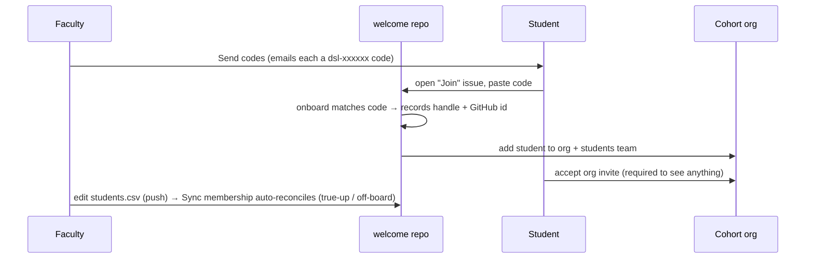

# Enrol students

How students get into the cohort org and the `students` team - gated by an enrolment code
emailed to their university address, so only registrar-listed students can join, and their
GitHub handle is captured unspoofably.

## Prerequisites

- A bootstrapped [cohort org](04-new-cohort-org.md) with the roster loaded in
  `classroom-config/students.csv`.
- To actually *send* email: the `GRAPH_*` (preferred) or `SMTP_*` Actions secrets. Without
  them every send runs as a **`dry_run`** preview (codes are still written to the roster).

## Flow

## Steps

1. **Send codes.** Course org → `.github` → **Actions** →
   [Send codes](https://github.com/DSL-Demo-Course-E1234/.github/actions/workflows/send-codes.yml),
   pick the cohort. Generates a random `enrol_code` per roster row, writes it back to
   `students.csv`, and emails each student at their `hertie_email`.

2. **Students self-onboard.** Each opens a **Join** issue in the cohort's `welcome` repo and
   pastes their code. The `onboard` workflow matches it to their roster row, records their
   (unspoofable, issue-author) GitHub handle + immutable id, and adds them to the org +
   `students` team. **They must accept the org invite** before they can see anything.

3. **Sync membership runs automatically.** Any push to `classroom-config/students.csv`
   triggers [Sync membership](https://github.com/DSL-Demo-Course-E1234/.github/actions/workflows/sync-membership.yml),
   reconciling the `students` team from the roster (a true-up after self-onboarding) - a
   deleted row off-boards that student on the same push, no separate prune step. A daily
   cron also re-runs it as a safety net; `workflow_dispatch` is a manual escape hatch.

## Group assignments (optional)

Students open a **Join team** issue in `welcome` (or faculty edit
`classroom-config/teams.csv`: `assignment, team, github_handle`) - either way, the push
triggers **Sync membership**, which materialises a GitHub team per group; a group
**Release assignment** then grants each team its shared repo.

## Next

- [Release to the cohort](07-release-assignment-to-cohort.md) - once students are onboarded, assignment
  release generates one private repo per student.

---
**Demo:** Join issue in [`DSL-Demo-f2026/welcome`](https://github.com/DSL-Demo-f2026).
