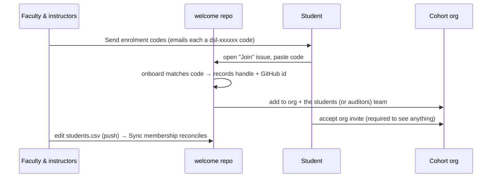

# Enrol students

Students get into the cohort org and its role team by pasting an **enrolment code** emailed to
their university address - so only registrar-listed people can join, and their GitHub handle is
captured unspoofably.

## Prerequisites

- A bootstrapped [cohort org](04-new-cohort-org.md) with the roster loaded in
  `classroom-config/students.csv`.
- To actually *send* email: the `GRAPH_*` (preferred) or `SMTP_*` Actions secrets. Without them
  every send stays a preview (codes are still written to the roster).

## Flow

```mermaid
sequenceDiagram
  participant F as Faculty & instructors
  participant W as welcome repo
  participant S as Student
  participant O as Cohort org
  F->>S: Send enrolment codes (emails each a dsl-xxxxxx code)
  S->>W: open "Join" issue, paste code
  W->>W: onboard matches code → records handle + GitHub id
  W->>O: add to org + the students (or auditors) team
  S->>O: accept org invite (required to see anything)
  F->>W: edit students.csv (push) → Sync membership reconciles
```

## Steps

1. **Send enrolment codes.** Course org → `.github` → **Actions** →
   [Send enrolment codes](https://github.com/DSL-Demo-Course-E1234/.github/actions/workflows/send-codes.yml),
   pick the cohort. Writes a random `enrol_code` onto every roster row that lacks one and emails
   it to each not-yet-onboarded student at their `hertie_email`.

   > **`dry_run` defaults to `true`** - the first run only previews the codes and emails. Untick
   > it to actually write and send.

2. **Students self-onboard.** Each opens a **Join** issue in the cohort's `welcome` repo and
   pastes their code. `onboard` matches it to their roster row, records their (unspoofable,
   issue-author) GitHub handle + immutable id, and adds them to the org and the team their
   `role` names - `students`, or `auditors` for a read-only auditor. **They must accept the org
   invite** before they can see anything.

3. **Sync membership runs itself.** Any push to `classroom-config/students.csv` triggers it,
   reconciling both role teams from the roster - so deleting a row off-boards that student on
   the same push, and changing their `role` moves them between teams. A daily cron re-runs it as
   a safety net; the button is a manual escape hatch.

## Auditors

Set `role: auditor` on a roster row. That student joins the `auditors` team, which gets **read
on every released-materials repo, exactly like enrolled students** - the split is assignments
and grades, not content. Auditors get no assignment repo, no gradebook and no marks, and are
politely refused (with a `needs-review` label for you) if they open a **Join team** issue.
Everything else is identical, including their enrolment code. A blank or missing `role` means
enrolled.

## Group assignments (optional)

Students open a **Join team** issue in `welcome` (or you edit `classroom-config/teams.csv`:
`assignment, team, github_handle`) - either way the push triggers **Sync membership**, which
materialises a GitHub team per group. A **Release assignment** run with `group` ticked then
grants each team its shared repo.

## Next

- [Release an assignment](07-release-assignment-to-cohort.md) once students have onboarded.

---
**Demo:** Join issue in [`DSL-Demo-f2026/welcome`](https://github.com/DSL-Demo-f2026).
