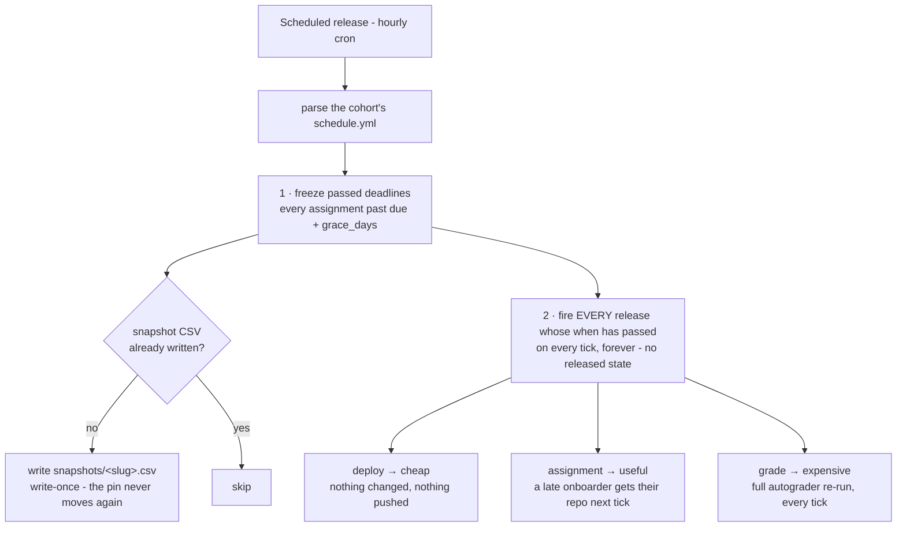

# Schedule releases

Write the term's plan into the cohort's `classroom-config/schedule.yml` once, and the hourly
cron runs the term for you - every materials release, every assignment hand-out, every
autograde run.

## Prerequisites

- A bootstrapped [cohort](04-new-cohort-org.md) - *Bootstrap cohort* seeds both
  `classroom-config/schedule.yml` and the cron.
- The course-org repos you'll name as sources: [materials](02-add-materials-to-course.md),
  [assignment templates](03-add-assignment-to-course.md), [code](10-release-code.md).

## Write your term's plan

`materials_releases:` maps a free-form label to a `when` plus any mix of three actions:

| Action | Does |
|--------|------|
| `deploy` | copy a source path from a course repo → a cohort repo (materials, code, datasets) |
| `assignment` | provision one private repo per onboarded student from a template |
| `grade` | run the faculty-side autograder |

```yaml
timezone: Europe/Berlin
materials_releases:
  week-2:
    when: 2026-09-15T09:00
    deploy:
      - {source_repo: course-materials-f2026, source_path: lectures/02_week-2, dest_repo: materials}
      - {source_repo: lecture-code-f2026, source_path: mlpkg/simulation, dest_repo: materials}
  assignment-1-handout:
    when: 2026-09-22T09:00
    assignment: assignment-1-f2026
  assignment-1-grade:
    when: 2026-10-15T00:00
    grade: {template: assignment-1-f2026}
```

Full schema: [the schedule](required-input-schema.md#the-schedule). 

## Verify your schedule before trusting it

1. **Dry-run the cron.** Run **Scheduled release** by hand - `dry_run` defaults to **`true`**,
   so it lists what *would* open and releases nothing. The best preflight there is.
2. **Dump the parsed schedule.**
   `python3 -m dsl_course.schedule --cohort-org DSL-Demo-f2026` prints the schedule *as parsed*,
   as JSON. A mistyped entry simply isn't there - which is how you catch a silent drop.
3. **Read the counts.** **Show status** reports the release plan as
   *"N scheduled release(s), M action(s)"* and the due dates as *"start=…, N due date(s),
   N exam(s)"*. Counts lower than what you wrote means something didn't parse.

## Silent failures

 **The schedule never errors - it drops.** Nothing below fails a run:
> - a malformed or missing **`when`** → that whole release is dropped;
> - a malformed or missing **`due`** → the whole `assignments:` entry is dropped, and the
>   grading deadline then falls back to *today* at grading time;
> - a non-integer **`grace_days`** → silently treated as `0`;
> - an unknown or misspelt **`timezone:`** → silently falls back to `Europe/Berlin`;
> - a `deploy` entry missing **`source_repo`** or **`source_path`** → silently skipped.
>
> Which is exactly why you run the three checks above rather than assuming the file is right.

## Timezones and bare dates

- Everything naive is read in the cohort's `timezone:` (default `Europe/Berlin`).
- An explicit offset (`2026-09-15T14:00+02:00`) is honoured as written.
- A **bare date** with no time means **00:00** on a release `when` (the day opens), **23:59:59** on an assignment `due` (the day closes), and a whole day for an exam `date` (the site shows a 09:00 placeholder).

## Deadline snapshots

Shortly after `due + grace_days` passes, the same hourly run records each submission repo's HEAD into `classroom-config/snapshots/<slug>.csv`, using the **server's** clock. It is **write-once** - a later push can't move the pin. To deliberately re-freeze (repos provisioned late, say), delete the CSV and the next tick rebuilds it.

If grading runs with **no snapshot at all**, it falls back to a date-based pin over
student-supplied committer dates and says so loudly in the run log. Full flow:
[Grade and return assignments](09-grade-and-return-assignments.md).

## What happens on each tick

First **freeze passed grading deadlines** - snapshot every assignment whose `due + grace_days`
has gone by and isn't frozen yet (see below) - then **fire every due release**.



---
## Next

- [Release materials](07-release-materials-to-cohort.md) /
  [an assignment](08-release-assignment-to-cohort.md) /
  [code](10-release-code.md) by hand, when you need the fallback.
- [Grade and return assignments](09-grade-and-return-assignments.md).

---
**Demo:** `classroom-config/schedule.yml` in [`DSL-Demo-f2026`](https://github.com/DSL-Demo-f2026),
run by [Scheduled release](https://github.com/DSL-Demo-Course-E1234/.github/actions/workflows/scheduled-release.yml).
