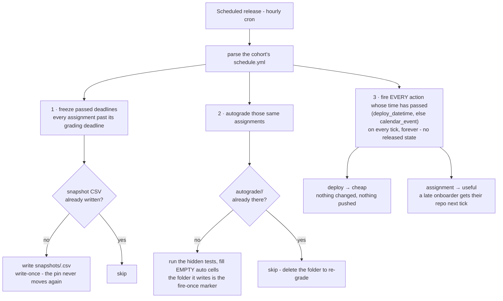

# Schedule releases

Write the term's plan into the cohort's `classroom-config/schedule.yml` once, and the hourly
cron runs the term for you - every materials release, every assignment hand-out, every
autograde run.

## Prerequisites

- A bootstrapped [cohort](04-new-cohort-org.md) - *Bootstrap cohort* seeds both
  `classroom-config/schedule.yml` and the cron.
- The course-org repos you'll name as sources: [materials](02-add-materials-to-course.md),
  [assignment templates](03-add-assignment-to-course.md), [code](10-release-code.md).

## Write your term's plan

Live example (a full term): [`example-course/cohort-org/schedule.yml`](../../example-course/cohort-org/schedule.yml).

Two blocks carry the whole term:

- **`materials_releases:`** - teaching materials and calendar events. A free-form label maps
  to a `calendar_event` plus, optionally, `deploy` actions (copy a source path from a course
  repo → a cohort repo: materials, code, datasets).
- **`assignments:`** - each assignment's **whole lifecycle in one block**, keyed by slug:
  `handout` (when repos are provisioned - one per student, or per **team** when the
  template's `grading.yml` says `type: group`), `due` (what students see),
  `grading_deadline` (when it is snapshotted and autograded, once - see
  [below](#deadline-snapshots-and-autograding)), and `max_team_size` (group assignments).

Nothing assignment-related needs a `materials_releases` entry (a legacy `assignment:` action
there is still honoured).

**The calendar event is not the release.** Each entry's `calendar_event:` is when the thing
*happens* - that is what the cohort's `.github.io` site's deployed schedule shows (and  is the default fire time for the
entry's actions). However, a deploy can also carry its own separate `deploy_datetime:` to ship its files earlier (or
later) than the class they belong to. And an entry with **no deploy actions at all** is a
display-only calendar event - e.g. an exam, a drop-in clinic, a guest lecture etc: nothing deploys, the row
simply appears on the cohort site (optionally with a `title:`). 

> Exams work the same way, viathe dedicated `exams:` block below.

Start **minimal** - only `source_repo` + `source_path` are required, everything else
defaults (into the cohort's `materials` repo, at the same path, at the event time):

```yaml
  lecture_02:
    calendar_event: 2026-09-15T10:00
    deploy:
      - {source_repo: course-materials-f2026, source_path: lectures/02_intro}
      # -> lands at materials/lectures/02_intro when the class starts

  lab_02:
    calendar_event: 2026-09-17T14:00
    deploy:
      - {source_repo: course-materials-f2026, source_path: labs/02_intro}
```

Paths are **relative to their repo**: `source_path` inside `source_repo`, `dest_path`
inside `dest_repo`. Spell fields out only where a default doesn't fit - a different
destination repo/path, or an early ship time:

```yaml
  lecture_02:
    calendar_event: 2026-09-15T10:00   # the class - what the site announces
    deploy:
      - {source_repo: course-materials-f2026, source_path: lectures/02_intro,
         dest_repo: lecture_materials, deploy_datetime: 2026-09-15T09:00}  # slides out 1h early
      - {source_repo: course-materials-f2026, source_path: readings/02_intro,
         dest_repo: lecture_materials}                                     # out at class time

  lab_02:
    calendar_event: 2026-09-17T14:00   # the lab session
    deploy:
      - {source_repo: course-materials-f2026, source_path: labs/02_intro,
         dest_repo: lab_materials}

  project-clinic:                      # no actions -> display-only site row
    calendar_event: 2026-11-17T10:00
    title: Project clinic
    tbc: true                          # provisional date - fires as normal, site shows "(TBC)"

  guest-lecture:                       # not even a sketch yet: the site shows a TBC row
    calendar_event: tbc                # (sorted end-of-term); nothing fires until a real
    title: Guest lecture               # date replaces `tbc`
```

**Uncertain dates.** `tbc: true` next to any date (a release entry or an exam) sketches a
provisional slot: everything fires at that date as normal, but the site marks it **(TBC)**
so students know it may move. `calendar_event: tbc` (or an exam's `date: tbc`) is for no
date at all: the row appears as **TBC** and nothing fires until you commit a real date -
which, like any change, is just an edit to `schedule.yml` on `main`.

(`dest_repo` is yours to choose - one shared `materials` repo, or one per section as here;
the repo is created on first release.)

```yaml
timezone: Europe/Berlin
materials_releases:
  lecture_02:
    calendar_event: 2026-09-15T10:00
    deploy:
      - {source_repo: course-materials-f2026, source_path: lectures/02_week-2}
      - {source_repo: lecture-code-f2026, source_path: mlpkg/simulation}
  lab_02:
    calendar_event: 2026-09-17T14:00
    deploy:
      - {source_repo: course-materials-f2026, source_path: labs/02_week-2}

assignments:
  assignment-1:
    handout: 2026-09-22T09:00       # optional - one repo per student from assignment-1-<tag>
    due: 2026-10-13                 # REQUIRED - what students see
    grading_deadline: 2026-10-15    # optional - snapshot freezes + autograded (default: due)
```

Field-by-field tables (required/optional/defaults):
[the schedule](DEPLOYMENT-CHECKLIST.md#scheduleyml).

Full schema: [the schedule](DEPLOYMENT-CHECKLIST.md#scheduleyml).

## Changing dates mid-term

Just commit the edit to `classroom-config/schedule.yml` on `main` - the **GitHub web UI is
the recommended way** (or edit a local clone → commit → push). The hourly cron reads
whatever is on `main` at each tick, so the change takes effect within the hour; there is
nothing to re-arm or re-deploy. The one caveat: already-fired **one-shot** actions don't
rewind - a release already shipped stays shipped, and a snapshot/autograde that already ran
re-runs only if you delete its marker (`snapshots/<slug>.csv` / `autograde/<slug>/`).

## If you want to verify your schedule before trusting it

1. **Dry-run the cron.** Run **Scheduled release** by hand - `dry_run` defaults to **`true`**,
   so it lists what *would* open and releases nothing. The best preflight there is.
2. **Dump the parsed schedule.**
   `python3 -m dsl_course.schedule --cohort-org DSL-Demo-f2026` prints the schedule *as parsed*,
   as JSON. A mistyped entry simply isn't there - which is how you catch a silent drop.
3. **Read the counts.** **Show status** reports the release plan as
   *"N scheduled release(s), M action(s)"* and the due dates as *"start=…, N due date(s),
   N exam(s)"*. Counts lower than what you wrote means something didn't parse.

## Silent failures

> **The schedule never errors - it drops.** Nothing below fails a run:
> - a malformed or missing **`calendar_event`** (or legacy `when`) → that whole entry is dropped;
> - a malformed **`deploy_datetime`** → ignored, and that copy ships at the `calendar_event`;
> - a malformed or missing **`due`** → the whole `assignments:` entry is dropped, and the
>   grading deadline then falls back to *today* at grading time;
> - a malformed **`grading_deadline`** → ignored, and the deadline falls back to `due`;
> - an unknown or misspelt **`timezone:`** → silently falls back to `Europe/Berlin`;
> - a `deploy` entry missing **`source_repo`** or **`source_path`** → silently skipped.
>
> Which is exactly why you run the three checks above rather than assuming the file is right.

## Timezones and bare dates

- Everything naive is read in the cohort's `timezone:` (default `Europe/Berlin`).
- An explicit offset (`2026-09-15T14:00+02:00`) is honoured as written.
- A **bare date** with no time means **00:00** on a `calendar_event`/`deploy_datetime` (the day opens), **23:59:59** on an assignment `due` (the day closes), and a whole day for an exam `date` (the site shows a 09:00 placeholder).

## Deadline snapshots and autograding

Each assignment's **grading deadline** is `grading_deadline` if you set it, else `due`.
Shortly after it passes, the hourly run does two things,
once each:

1. **Freezes** each submission repo's HEAD into `classroom-config/snapshots/<slug>.csv`, using
   the **server's** clock. **Write-once** - a later push can't move the pin. To re-freeze
   (repos provisioned late, say), delete the CSV and the next tick rebuilds it.
2. **Autogrades** it, against the `<slug>-<tag>` template in the course org. The marker is the
   `classroom-config/autograde/<slug>/` folder: while it exists, no further grading happens.
   To re-grade, delete it. An assignment with no template repo, no hidden tests, or
   `autograde: false` is skipped, not failed.

If grading runs with **no snapshot at all**, it falls back to a date-based pin over
student-supplied committer dates and says so loudly in the run log. Full flow:
[Grade and return assignments](09-grade-and-return-assignments.md).

## What happens on each tick

**Freeze**, then **autograde**, each passed grading deadline - once, ever - then **fire every
due release**.



---
## Next

- [Release materials](07-release-materials-to-cohort.md) /
  [an assignment](08-release-assignment-to-cohort.md) /
  [code](10-release-code.md) by hand, when you need the fallback.
- [Grade and return assignments](09-grade-and-return-assignments.md).

---
**Demo:** `classroom-config/schedule.yml` in [`DSL-Demo-f2026`](https://github.com/DSL-Demo-f2026),
run by [Scheduled release](https://github.com/DSL-Demo-Course-E1234/.github/actions/workflows/scheduled-release.yml).
