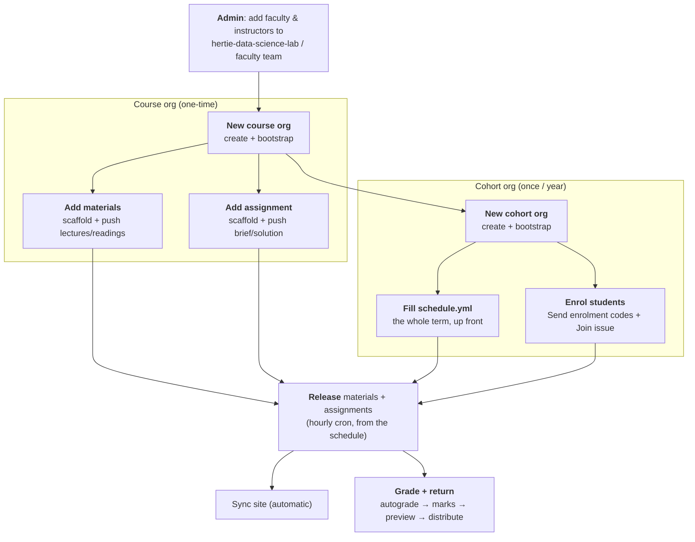

# Faculty & instructors workflows

Step-by-step runbooks for the faculty- and instructor-facing processes, end to end. Each is a
button (GitHub Actions) plus, where noted, a `git push` of your own content.

> **Read these first.** They are the **how/when**. The
> [input schema](required-input-schema.md) is the **what** (column schemas, file layouts) - a
> reference to reach for once you know the flow, not a starting point. Each step is also
> self-documenting at the time of use: it generates READMEs and placeholders telling you what
> comes next.

## The two tiers

| Tier | Lives in | Lifetime | Holds |
|------|----------|----------|-------|
| **Course org** | e.g. `<course-name>-<CODE>` | persistent (all years) | materials, assignment templates, the faculty & instructors console (`.github`) |
| **Cohort org** | e.g. `<course-name>-f/sYYYY` | one per year | released materials, student repos, roster, the cohort website |

The course org is the source of truth; each cohort org receives **releases** of it. Full
model: [`../admin/architecture.md`](../admin/architecture.md).

## End-to-end path

## Who can run what (access)

Two separate populations - neither ever holds the bot token:

| Button | Gated by | Where it lives |
|--------|----------|----------------|
| **Bootstrap Course Org** | `faculty` / `admin` team in **`hertie-data-science-lab`** | [central repo Actions](https://github.com/hertie-data-science-lab/dsl-teaching-course-setup/actions) |
| Every **course button** | write on the course org's `.github` - i.e. its **`course-admin`** team (`course_admins`) or an **`instructors-<tag>`** team (a cohort's own `people.yml`) | the course org's `.github` Actions tab |

Neither is automatic - you're declared in a config file and **Sync membership** grants it, then
you accept a one-time org invite. Detail:
[admin-setup → who can run which action](../admin/admin-setup.md#who-can-run-which-action).
The bot (`hertie-dsl-bot`) must be an **Owner** of every org - the one irreducible manual
prerequisite (no org-creation API).

## The workflows

Numbered in reading order - **course-level** (1-3) before **cohort-level** (4-8):

| # | Workflow | Tier | When |
|---|----------|------|------|
| 1 | [New course org](01-new-course-org.md) | course | once, when a course first goes on the platform |
| 2 | [Add materials to course](02-add-materials-to-course.md) | course | per materials repo (usually once/year) |
| 3 | [Add assignment to course](03-add-assignment-to-course.md) | course | per assignment |
| 4 | [New cohort org](04-new-cohort-org.md) | cohort | once per year - includes filling the term's schedule |
| 5 | [Enrol students to cohort](05-enrol-students-to-cohort.md) | cohort | start of each cohort |
| 6 | [Release materials to cohort](06-release-materials-to-cohort.md) | cohort | scheduled; the button is for ad-hoc release |
| 7 | [Release assignment to cohort](07-release-assignment-to-cohort.md) | cohort | scheduled; the button is for ad-hoc hand-out |
| 8 | [Grade and return assignments](08-grade-and-return-assignments.md) | cohort | per assignment, after the deadline |

Fill in step 4's `schedule.yml` for the whole term and the hourly cron does 6, 7 and the
autograde half of 8 for you.

For a one-page summary of **every button**, see [`actions-reference.md`](actions-reference.md).

## Demo orgs (live reference)

A standing demo you can point at while reading:

- Course org: **[`DSL-Demo-Course-E1234`](https://github.com/DSL-Demo-Course-E1234)** · console: [`.github` Actions](https://github.com/DSL-Demo-Course-E1234/.github/actions)
- Cohort org: **[`DSL-Demo-f2026`](https://github.com/DSL-Demo-f2026)**
