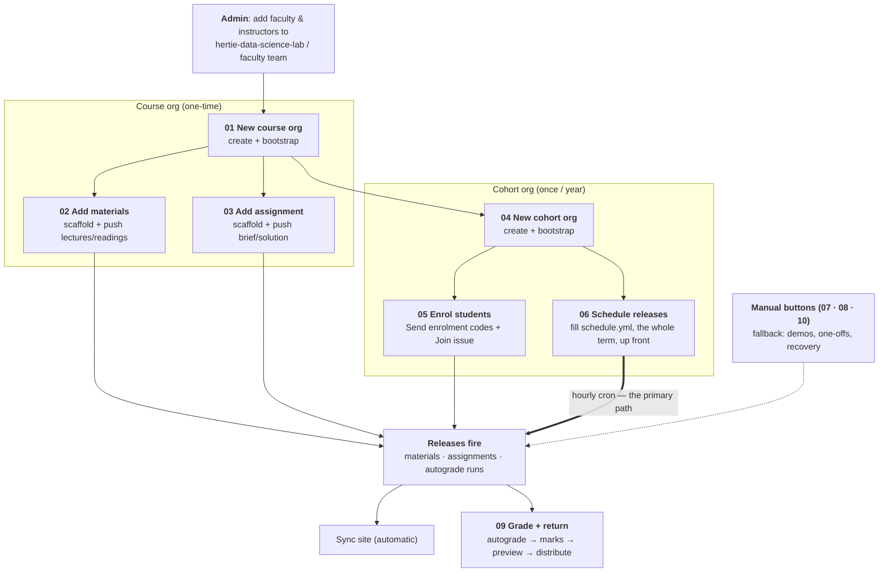

# Faculty & instructors workflows

Step-by-step runbooks for the faculty- and instructor-facing processes, end to end. Each is a
button (GitHub Actions) plus, where noted, a `git push` of your own content.

> NB: all workflows can be automated at the start of the semester by correctly filling out the cohort org's `schedule.yml` for that semster. This will then automatically handle all release of materials / assignments / grades etc, with manual GH action buttons in the course org's `.github` repo for ad hoc runs of specific workflows. 

## The two tiers

| Tier | Lives in | Lifetime | Holds |
|------|----------|----------|-------|
| **Course org** | e.g. `<course-name>-<CODE>` | persistent (all years) | materials, assignment templates, the faculty & instructors **control panel** (`.github`) |
| **Cohort org** | e.g. `<course-name>-f/sYYYY` | one per year | released materials, student repos, roster, the cohort website |

The course org is the single source of truth (SSOT); each cohort org receives **releases** of it.
Full model: [`../admin/architecture.md`](../admin/architecture.md).

## End-to-end path

## The workflows

Numbered in reading order - **course-level** (01-03) before **cohort-level** (04-10):

| # | Workflow | Tier | When |
|---|----------|------|------|
| 01 | [New course org](01-new-course-org.md) | course | once, when a course first goes on the platform |
| 02 | [Add materials to course](02-add-materials-to-course.md) | course | per materials repo (usually once/year) |
| 03 | [Add assignment to course](03-add-assignment-to-course.md) | course | per assignment |
| 04 | [New cohort org](04-new-cohort-org.md) | cohort | once per year |
| 05 | [Enrol students to cohort](05-enrol-students-to-cohort.md) | cohort | start of each cohort |
| 06 | [**Schedule releases**](06-schedule-releases.md) | cohort | once per cohort, up front - **the primary release path** |
| 07 | [Release materials to cohort](07-release-materials-to-cohort.md) | cohort | fallback: ad-hoc release |
| 08 | [Release assignment to cohort](08-release-assignment-to-cohort.md) | cohort | fallback: ad-hoc hand-out |
| 09 | [Grade and return assignments](09-grade-and-return-assignments.md) | cohort | per assignment, after the deadline |
| 10 | [Release code](10-release-code.md) | cohort | when the course ships a growing package to students |

The schedule (`materials_releases` in `schedule.yml`) is the primary release mechanism; the manual
release buttons are the fallback - for demos, one-offs, and recovery. Fill in
[06](06-schedule-releases.md)'s `schedule.yml` for the whole term and the hourly cron does 07, 08
and the autograde half of 09 for you.

For a one-page summary of **every button**, see [`actions-reference.md`](actions-reference.md).

## Who can run what (access)

Two separate populations - neither ever holds the bot token:

| Button | Gated by | Where it lives |
|--------|----------|----------------|
| **Bootstrap Course Org** | `faculty` / `admin` team in **`hertie-data-science-lab`** | [central repo Actions](https://github.com/hertie-data-science-lab/dsl-teaching-course-setup/actions) |
| Every **course button** | write on the course org's `.github` - i.e. its **`course-admin`** team (`course_admins`) or an **`instructors-<tag>`** team, where `<tag>` is the cohort's `fYYYY`/`sYYYY` suffix and membership comes from that cohort's own `people.yml` | the course org's `.github` Actions tab |

Neither is automatic - you're declared in a config file and **Sync membership** grants it, then
you accept a one-time org invite. Three distinct teams are called "instructors"; the
[glossary](../START-HERE.md#glossary) tells them apart. Detail:
[access model](../admin/architecture.md#access-model--two-populations), and
[`../admin/course-admin.md`](../admin/course-admin.md) for running a course day to day.
The bot (`hertie-dsl-bot`) must be an **Owner** of every org - the one irreducible manual
prerequisite (no org-creation API).

## Demo orgs (live reference)

A standing demo you can point at while reading:

- Course org: **[`DSL-Demo-Course-E1234`](https://github.com/DSL-Demo-Course-E1234)** · control panel: [`.github` Actions](https://github.com/DSL-Demo-Course-E1234/.github/actions)
- Cohort org: **[`DSL-Demo-f2026`](https://github.com/DSL-Demo-f2026)**
