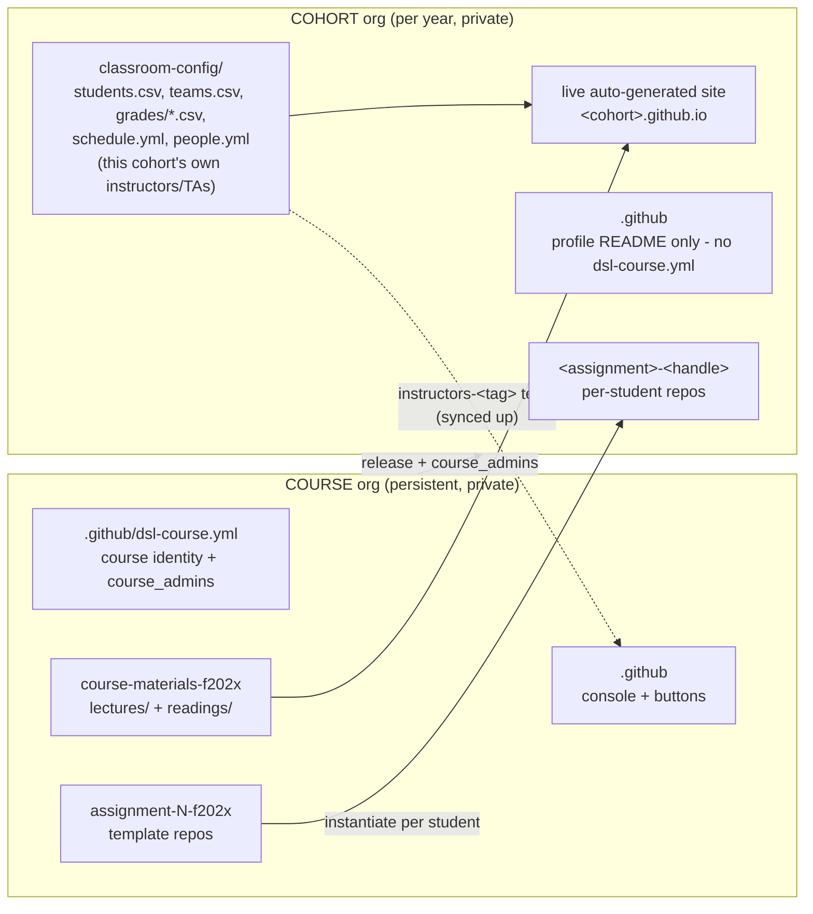

# Required input schema

This is the authoritative checklist of **every input** needed to stand up a fully working
course + cohort from scratch. For a ready-to-run worked example
with dummy data, see [`example-course/`](../../example-course/README.md).

Everything faculty-facing is a **GitHub Actions button** (also exposed as CLI commandds). The Python
in `dsl_course/` is the single implementation behind every button.

## Deployment checklist

The fast path: tick these off in order. `[required]` must be done to deploy; everything else
is synthesised or skipped if you leave it. Each item names the **exact place** the input
lives - the [grouped tables](#the-inputs-grouped) below expand on every one. (Copy this block
into a tracking issue and tick as you go.)

### Course setup (once)

- [ ] `[required]` Create the **course org** in the GitHub web UI, then add **`hertie-dsl-bot`** as **Owner** (the one manual step - no org-creation API).
- [ ] `[required]` Run [**Bootstrap Course Org**](https://github.com/hertie-data-science-lab/dsl-teaching-course-setup/actions/workflows/bootstrap-org.yml) from this repo's Actions tab (`org`, `org_name`, `course_code`; optional `admin`). This also sets `DSL_BOT_TOKEN` on the org - you don't set the secret by hand. See [Token](#token).
- [ ] `[required]` **Materials**: scaffold with **New materials repo**, then fill `course-materials-fYYYY/lectures/00_.../` and `readings/00_.../` with any files (any top-level dir with ordinal-prefixed subdirs is a releasable section - add more freely). *(optional: a `*syllabus*` file + `README` at the repo root.)*
- [ ] `[required]` **Assignments** (≥1): scaffold with **New assignment**, then on `main` add the brief (`README.md`) + starter. *(optional: on the `solution` branch, the model solution in `solution/`, and - to autograde - hidden tests in `tests/` plus a `grading.yml`. Student repos get `main` only.)*
- [ ] *(optional)* **Course admins**: edit the `people:` block in the **course org's** `.github/dsl-course.yml` → `course_admins` (`github_handle` required per entry, grants course-wide admin access; optional `start`/`end` dates for auto-rotation). A push here (or the daily cron) reconciles access in the course org AND every cohort. Instructors/TAs are declared per cohort instead - see Cohort setup below.
- [ ] *(optional)* **Email**: to actually send enrolment-code + grade emails, add the `GRAPH_*` (Microsoft Graph, preferred) or `SMTP_*` Actions secrets. See [Email](#email-optional). *(Without them, every email step still runs as a `dry_run` preview.)*
- [ ] `[required]` Run **Refresh actions** so every content repo gets its Release buttons, the secret propagates, and all dropdowns populate.

### Cohort setup (per year)

- [ ] `[required]` Create the **cohort org** in the GitHub web UI; add **`hertie-dsl-bot`** as **Owner**.
- [ ] `[required]` From the **course org's** Actions tab, run **Bootstrap cohort** (give it the empty cohort org's name). Seeds `welcome` + `classroom-config`, scaffolds the site, registers the cohort, propagates the token, and applies the course org's current `course_admins`.
- [ ] `[required]` **Roster**: edit `classroom-config/students.csv` with registrar data - `student_id, hertie_email, name, section`. Leave `github_handle, github_id` blank; students fill them by onboarding.
- [ ] *(optional)* **Instructors/TAs**: edit `classroom-config/people.yml` → `instructors`/`teaching_assistants` (`github_handle` required per entry). Most cohorts have different lecturers/TAs, so this is declared per cohort, not at the course level.
- [ ] *(optional)* **Schedule**: edit `classroom-config/schedule.yml` (sessions/labs release calendar, semester dates, assignment due dates, exams - real dates). If omitted, dates are synthesised and the cron simply has nothing to auto-open.
- [ ] `[required]` Run the per-session loop: **Release materials** (per session) and **Release assignment** (per assignment). Students onboard themselves via the **Join** issue in `welcome`; a push to `students.csv` triggers **Sync membership** automatically to reconcile the `students` team from the roster.
- [ ] *(optional)* **Grade + return marks**: **Grade assignment** (autogrades after the deadline, if you added hidden tests) → edit `classroom-config/grades/<assignment>.csv` (add manual marks) → **Sync gradebooks** → **Render grades** (preview PR, also generates a read-only `cohort-gradebook.csv` glance view) → **Distribute grades** (emails each student).
- [ ] *(optional)* **Show status**: run the **Show status** button any time to see, per cohort, everything above at a glance - what's configured, what's still missing, and a direct edit link for each.

## What you end up with



The course org is the source of truth for identity + course-wide admin access; each
cohort is the source of truth for its own roster/teams/grades/schedule/instructors,
receiving materials releases from the course org. Run **Show status** any time for a
live, per-cohort rendering of this same picture - what's configured in each location,
and a direct edit link for anything missing.

## The input-schema contract

Every part of a course has **one canonical place**. Put your inputs there, run the
buttons, and the pipeline reads them and generates a full, delivery-ready course +
website. 

1. `.github/dsl-course.yml` is the **config contract** for the course org (identity +
   `course_admins` - the SSOT for course-wide admin access, mirrored into every
   cohort). A cohort org has no `dsl-course.yml` of its own;
2. `course-materials-fYYYY` repo is the **content contract** (lectures/readings/syllabus by session);
3. `assignment-*-fYYYY` template repos are the **assignment contract**;
4. the cohort's `classroom-config` repo is the **per-cohort contract** - roster (`students.csv`), teams (`teams.csv`), grades (`grades/*.csv`), schedule (`schedule.yml`), and this cohort's own instructors/TAs (`people.yml`), all in one private repo.

The pipeline: `Bootstrap → Release materials/assignment → (auto) Sync site` - turns those inputs into the
running course. _Anything you don't supply is synthesised or skipped, never blocks._

| Element | Input location | Becomes on the site / cohort |
|-------|-----------------|------------------------------|
| **Course identity** (name, code) | **course** `.github/dsl-course.yml` → `org_name`, `course_name`, `course_code` |  site title + header |
| **Semester** | derived from the cohort org's `fYYYY`/`sYYYY` tag |  "Fall 2026" + schedule anchor |
| **Course admins** | **course** `.github/dsl-course.yml` → `people:` → `course_admins` (`github_handle` required; optional `start`/`end`) - the SSOT, mirrored into every cohort's `course-admin` team | course-wide admin access (course org + every cohort); optional `instructors`/`teaching_assistants` entries here are display-only (site cards), grant no access |
| **Instructors/TAs** | **cohort** `classroom-config/people.yml` → `instructors`/`teaching_assistants` (`github_handle` required; optional `start`/`end`) | push access to that cohort's own team + a course-org `instructors-<tag>` team scoped to that year's content repos |
| **Schedule** (semester dates, due dates, exams) | **cohort** `classroom-config/schedule.yml` → `semester_start`/`semester_end`, `assignments`, `exams` |  the schedule table (lectures, due dates, exams) |
| **Release calendar** (sessions/labs) | **cohort** `classroom-config/schedule.yml` → `sessions`/`labs` | drives the daily **Scheduled release** cron |
| **Lectures** | `course-materials-fYYYY/lectures/<NN>_.../` (any files; any dir with ordinal-prefixed subdirs is a section) |  per-session lecture entries linking the released files |
| **Readings** | `course-materials-fYYYY/readings/<NN>_.../` (any files) |  per-session reading links |
| **Syllabus** | `course-materials-fYYYY/` root file matching `*syllabus*` |  cohort root + syllabus link |
| **Assignments** | `assignment-N-fYYYY` template repo: `README.md` (brief), `starter.*` on `main`; `solution` branch with the model solution, `grading.yml`, and hidden tests | assignment briefs on the site + one private `<slug>-<handle>` repo per student |
| **Roster** | cohort `classroom-config/students.csv` (`student_id, hertie_email, name, section`) | enrolment + per-student provisioning |

## The inputs, grouped

### A. One-time, manual (cannot be automated)

| # | Input | How / where | Notes |
|---|-------|-------------|-------|
| A1 | **Create the course org** | GitHub web UI | GitHub has **no org-creation API** ([ADR 0011 §9]). Add the bot account as an **owner**. |
| A2 | **Create the cohort org** | GitHub web UI | Same - one per year. Add the bot as owner. |
| A3 | **`DSL_BOT_TOKEN`** | The bot's classic PAT | Scopes: `repo` + `admin:org` + `workflow`. The bot must be **owner on both orgs**. The only *required* secret. See [Token](#token). |
| A4 | **Email secrets** (optional) | `GRAPH_TENANT_ID/CLIENT_ID/CLIENT_SECRET/SENDER` (Microsoft Graph, preferred) **or** `SMTP_HOST/USER/PASSWORD` as org/repo Actions secrets | Only needed to *send* enrolment-code / grade emails; `dry_run` previews work without them. See [Email](#email-optional). |

Everything below is a button or a file edit.

### B. Course org content (persistent)

| # | Input | Supplied via | Mandatory | Stored as |
|---|-------|--------------|-----------|-----------|
| B1 | Course identity: `org`, `org_name`, `course_code` | **Bootstrap Course Org** button inputs | org + org_name + course_code | `.github/dsl-course.yml` |
| B2 | **Materials**: a `course-materials-fYYYY` repo with `lectures/00_.../` and `readings/00_.../` folders (any top-level dir with ordinal-prefixed subdirs is a section - no config to declare it) | **New materials repo** button scaffolds it; you add files | yes | course org repo |
| B3 | Syllabus / root README (optional) | Files at the materials-repo root | optional | copied to the cohort on release if toggled on |
| B4 | **Assignments**: one `assignment-N-fYYYY` **template** repo each (starter on `main`; the `solution` branch carries the model solution, `grading.yml`, and hidden tests) | **New assignment** button scaffolds it; you add the brief + starter (+ hidden tests on `solution` to autograde) | yes | course org template repos (`is_template`) |
| B5 | **Release manifest** (optional, for scheduled auto-release): `sessions:` → what opens each session (`materials` / `code` paths / `assignment`). **One file per cohort** (source repos are year-tagged) | Edit `.github/manifests/<cohort-org>.yml` | no (manual buttons work without it) | course org `.github` repo |
| B6 | **Course admins** - the SSOT for course-wide admin access, mirrored into every cohort's own `course-admin` team | Edit the `people:` block in the course org's `.github/dsl-course.yml` → `course_admins` (`github_handle` required per entry; optional `start`/`end` for auto-rotation) | no (no entries means no admin access to sync) |

*(Schedule is listed per-cohort - see C6. Instructors/TAs are also listed per-cohort - see
C7 - since most cohorts have different lecturers/TAs; only `course_admins` (course-wide
admin rights) is declared once on the course org and mirrored down.)*

### C. Per-cohort (each year)

| # | Input | Supplied via | Mandatory |
|---|-------|--------------|-----------|
| C1 | The empty cohort org name | **Bootstrap cohort** button | yes |
| C2 | **Roster**: registrar columns of `students.csv` (`student_id, hertie_email, name, section`) | Edit `classroom-config/students.csv` (private) | yes |
| C3 | **Grades** (optional, when returning marks): one CSV per assignment, `classroom-config/grades/<assignment>.csv` (`github_handle, team, auto, manual, team_grade, adjustment, final, comments, team_comments`) | **Grade assignment** can pre-fill `auto`/`team_grade` from hidden tests; faculty fill the rest, then **Sync gradebooks** → **Render grades** → **Distribute grades** | no |
| C4 | **Teams** (optional, for group assignments): `classroom-config/teams.csv` (`assignment, team, github_handle`) | Students self-select via the welcome **Join team** issue, or faculty edit the CSV directly | no |
| C5 | **Release calendar** (optional, pairs with the release manifest): `classroom-config/schedule.yml` → `sessions`/`labs` (session ordinal → date) | Edit `schedule.yml`; the daily **Scheduled release** cron opens each session's manifest items on its date | no |
| C6 | **Schedule dates** (semester start/end, assignment due dates + grace-days, exam dates) | Edit `classroom-config/schedule.yml` → `semester_start`/`semester_end`, `assignments`, `exams` (same file as C5) | optional (synthesised if blank) |
| C7 | **Instructors/TAs** - this cohort's own push access, plus a course-org `instructors-<tag>` team scoped to this year's content repos | Edit `classroom-config/people.yml` → `instructors`/`teaching_assistants` (`github_handle` required per entry; optional `start`/`end`) | no (no website card - only a course-org `people:` entry with a display `name` gets one) |

`github_handle` and `github_id` are **left blank** - students fill them by onboarding (below).

**Group teams materialise from `teams.csv`.** A push to it triggers **Sync membership**
(and a group **Release assignment**), reconciling a GitHub Team `<assignment>-<team>`
from the CSV - one-way, so the CSV stays authoritative and the Team can't drift. See
[ARCHITECTURE → Project teams](../admin/architecture.md#project-teams-group-assignments).

**Grades are private and previewable.** Each student gets one private `grades-<handle>`
repo (the single home for every mark - team project repos may be public, so grades never
go there). For an individual assignment, fill just `final` + `comments`; for a group
project, fill `team`, `team_grade`, that member's private `adjustment`, and the shared
`team_comments` (`final` is authoritative). **Render grades** builds per-student
`gradebook/<handle>.yml` and opens one PR - *that diff is the preview* - and **Distribute
grades** fans the merged files out to each private repo. A teammate never sees another
member's adjustment: it lives only in their own repo.

**Autograding is optional, partial, and fully private.** If an assignment's `solution`
branch carries hidden tests + a `grading.yml`, **Grade assignment** (a manual button, or a
`grade:` entry in the release manifest) runs those tests *faculty-side after the deadline*,
pinning each submission to its last commit on or before the deadline. It archives the raw
`result.json` under `classroom-config/autograde/` and writes the machine score into the
CSV's `auto` (individual) / `team_grade` (group) column. The `auto`/`manual` split lets you
autograde part and hand-mark the rest; neither column is ever shown to the student - their
repo gets no tests, no workflow, and no score, and they learn their mark only by email.

### D. Per-student (self-service, no faculty input)

A student opens a **Join** issue in `welcome` and types their **university email**. The
onboard workflow does the rest. See [How students are managed](#how-students-are-managed).

## How students are managed

Student lifecycle is **two separate stages** - *enrol once, provision per assignment*:

1. **Enrolment (access).** The registrar seeds `students.csv` with `hertie_email` (+ name,
   section, optional `student_id`); `github_handle`/`github_id` start blank. A student opens
   a **Join** issue in the public `welcome` repo and types their **university email**.
   `onboard.yml` (the one cohort-side action):
   - takes the issue **author** as the authenticated, unspoofable GitHub handle;
   - matches the typed email against the private roster's `hertie_email` - **non-enrolees
     are rejected** with a clear comment;
   - **redacts the email** from the public issue as soon as it's read (welcome is public;
     GitHub keeps edit history, so this minimises rather than eliminates exposure);
   - writes the handle + immutable `github_id` back onto that row - this *is* the email ↔
     GitHub-id mapping (keyed on the id, so a later handle rename never orphans repos),
     serialised against append races;
   - grants **org membership + `students` team** (the team carries cohort-private read, so
     released materials unlock);
   - comments confirmation, labels `enrolled`, closes the issue.

   A push to `students.csv` triggers **Sync membership** automatically: `sync_roster`
   reads it and reconciles the whole `students` team from it (idempotent). The daily
   cron and `workflow_dispatch` also re-run it as a manual escape hatch.

2. **Provisioning (per-assignment repos).** **Release assignment** for
   each students the `release assignment` workflow generates a private
   `<assignment>-<handle>` repo from the assignment template, then adds the student as
   collaborator.
   
**Submission** is a plain `git push` to `main` in the student's repo.

**Removal / rollover:** drop the row from `students.csv` and push - **Sync membership**
off-boards that member from the `students` team on the same push, no separate step.

Roster columns:

| Column | Filled by | Mandatory |
|--------|-----------|-----------|
| `student_id` | registrar (seed) | ✓ match key |
| `hertie_email` | registrar (seed) | ✓ reference + future grade export; PII → private only |
| `name` | registrar (seed) | ✓ |
| `github_handle` | **onboarding** | blank until the student joins |
| `github_id` | **onboarding** | blank until the student joins |
| `section` | registrar (seed) | ✓ |

## People

Split by role, declared in two different places - **access and website display are no
longer the same input**, so read this carefully:

- **`course_admins`** (course-wide admin access) is declared on the **course org's**
  `.github/dsl-course.yml` `people:` block - the SSOT, reconciled into the course org's
  own `course-admin` team and mirrored into every cohort's own `course-admin` team by
  **Sync membership**.
- **`instructors`/`teaching_assistants`** (push access) are declared **per cohort**, in
  that cohort's own `classroom-config/people.yml` - most cohorts have different
  lecturers/TAs. Reconciled into that cohort's own `instructors` team AND a course-org
  `instructors-<tag>` team scoped to that year's content repos, plus the central
  `.github` repo so its members can use the central dispatch buttons too.

`github_handle` is the only required field in either file; `start`/`end` (optional ISO
dates) auto-rotate access - access lapses on the `end` date with no manual removal.

```yaml
# course org's .github/dsl-course.yml
people:
  course_admins:
    - github_handle: "adminhandle"       # required - grants the `course-admin` team
      start: "2026-09-01"                # optional - no start = active immediately
      end: "2027-06-30"                  # optional - no end = indefinite
  # instructors/teaching_assistants CAN also be declared here, but only for the
  # website's instructor/TA cards (name/photo/url below) - it grants NO GitHub access
  # anywhere. For access, declare them in a cohort's own people.yml instead (below).
  instructors:
    - github_handle: "janedoe"           # display only here - see note above
      name: "Prof. Jane Doe"
      title: "Professor of ..."
      photo: "https://.../jane.jpg"      # image URL (shown on the card)
      url: "https://.../profile/jane"    # bio / profile link
```

```yaml
# cohort's classroom-config/people.yml
people:
  instructors:
    - github_handle: "janedoe"           # required - grants the `instructors` team
      name: "Prof. Jane Doe"             # optional, display only
      title: "Professor of ..."
      photo: "https://.../jane.jpg"
      url: "https://.../profile/jane"
      start: "2026-09-01"                # optional - no start = active immediately
      end: "2027-01-31"                  # optional - no end = indefinite
  teaching_assistants:
    - github_handle: "anOther"
      name: "..."                        # optional, display only
      photo: "https://.../ta.jpg"
      url: "https://.../profile/ta"
      start: "2026-09-01"
      end: "2027-01-31"
```

If the course org has no `people:` block, the site falls back to the course org's GitHub
`instructors` / `teaching-assistants` teams for cards (GitHub display name + avatar +
profile link) - but note that team is no longer kept in sync by **Sync membership**
either (see [ARCHITECTURE → Who can run which action](../admin/admin-setup.md#who-can-run-which-action)),
so anyone shown there got there by a direct, manual Teams-page edit.

## The schedule

`classroom-config/schedule.yml` is this cohort's single home for every date faculty
declare: the release calendar (`sessions`/`labs`, which drive the daily **Scheduled
release** cron) and the website schedule (`semester_start`/`semester_end`,
`assignments`, `exams`). It's a private, per-cohort file - no PII, just dates.

The website schedule is generated, not hand-built. By default dates are
**synthesised**: semester start = 1 Sep (fall) / 1 Feb (spring) of the cohort's `fYYYY`
tag; lectures weekly from there; assignments every 14 days; exams at weeks 8 and 15
(or bounded by `semester_end` if set).

To set **real** dates, edit `classroom-config/schedule.yml` and run **Sync site**:

```yaml
sessions:                             # release calendar - session ordinal -> date;
  "1": 2026-09-07                     # the Scheduled release cron opens each
  "3": 2026-09-21                     # session's manifest items on its date
labs:                                 # optional - a second, parallel release calendar
  "1": 2026-09-09                     # for a labs/<NN>_.../ section on its own cadence
semester_start: 2026-09-07            # YYYY-MM-DD
semester_end: 2026-12-18
assignments:                          # keyed by assignment slug (the repo name minus -fYYYY)
  assignment-1:
    due: 2026-10-13
    grace_days: 2                     # OPTIONAL: extra days for GRADING only (not
                                       # shown to students). Autograder pins to due + grace_days.
  assignment-2:
    due: 2026-11-17
exams:
  - name: MidTerm Exam
    date: 2026-11-03
  - name: Final Exam
    date: 2026-12-15
```

## Token

One secret, `DSL_BOT_TOKEN`, runs every workflow. It needs, **on both orgs**: repo admin
(create/generate repos, topics, settings), org members (invite + team), and contents R/W.

- The bot's **classic PAT** with `repo` + `admin:org` + `workflow`.
- **Free-plan caveat:** org secrets don't reach private repos, so Bootstrap sets it as an
  *org* secret (public `.github`/`welcome`) **and** Refresh propagates it as a *repo* secret
  on each private content repo. On GitHub Team/Enterprise org secrets reach private repos and
  this propagation is unnecessary.

## Email (optional)

Enrolment-code and grade-notification emails go through `dsl_course.mailer`, which uses
whichever transport is configured (a `--dry-run` preview needs neither):

- **Microsoft Graph (preferred)** - secrets `GRAPH_TENANT_ID`, `GRAPH_CLIENT_ID`,
  `GRAPH_CLIENT_SECRET`, `GRAPH_SENDER`. Needs an Entra app registration with the **Mail.Send**
  application permission, admin-consented and scoped to one shared mailbox.
- **SMTP (fallback)** - secrets `SMTP_HOST`, `SMTP_USER`, `SMTP_PASSWORD` (+ optional
  `SMTP_PORT`, `SMTP_FROM`). Works only where the tenant still allows SMTP AUTH.

Modern M365 tenants usually have SMTP AUTH disabled (the `5.7.139` error), so the Graph path
is typically required - confirm with your M365 admin which is available. Set the chosen secrets
at org level (or on the `.github` repo). Deliverability still needs SPF/DKIM/DMARC on the
sending domain.

## Known limits (not blockers)

- **Moodle** roster-in / grade-out is manual CSV until Hertie IT enables Web Services.
- **Pages are public** on the Free plan; access-controlled once on Campus/Enterprise.
