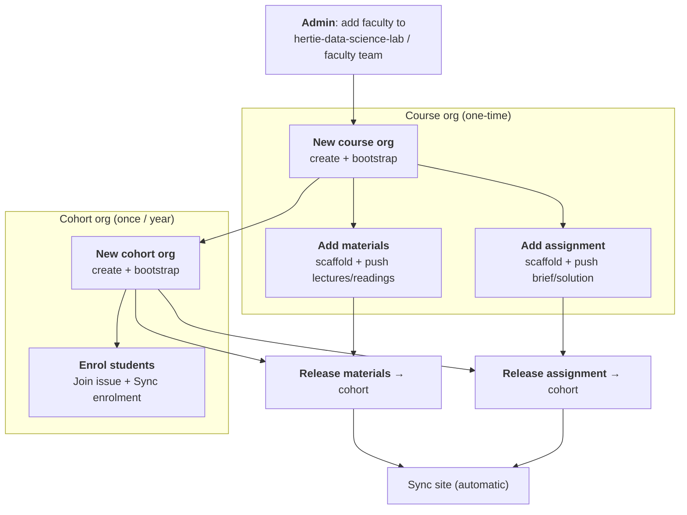

# Faculty workflows

Step-by-step runbooks for the faculty-facing processes, end to end. Each is a button
(GitHub Actions) plus, where noted, a `git push` of your own content.

> The process is **self-documenting at the time of use** - each step generates READMEs or
> placeholder files that tell you what to do next. These docs are the **full E2E overview**
> so you can see the whole path before you start.
>
> For the *what-goes-where* data contract (column schemas, file layouts), see
> [`required-input-schema.md`](required-input-schema.md). These workflow docs are the
> **how/when**; that one is the **what**.

## The two tiers

| Tier | Lives in | Lifetime | Holds |
|------|----------|----------|-------|
| **Course org** | e.g. `<course-name>-<CODE>` | persistent (all years) | materials, assignment templates, the faculty console (`.github`) |
| **Cohort org** | e.g. `<course-name>-f/sYYYY` | one per year | released materials, student repos, roster, the cohort website |

The course org is the source of truth; each cohort org receives **releases** of it. Full
model: [`../admin/architecture.md`](../admin/architecture.md).

## End-to-end path

## Who can run what (access)

Two separate populations - neither ever holds the bot token:

| Button | Gated by | Where it lives |
|--------|----------|----------------|
| **Bootstrap Course Org** | `faculty` / `admin` team in **`hertie-data-science-lab`** | [central repo Actions](https://github.com/hertie-data-science-lab/dsl-teaching-course-setup/actions) |
| Every **course button** (New materials/assignment, Refresh, Bootstrap cohort, Release, Sync) | write on the course org's `.github` → its **`instructors`** / **`course-admin`** team | the course org's `.github` Actions tab |

Team membership is **not** automatic - an org owner/admin adds you (see each workflow's
prerequisites). The bot account (`hertie-dsl-bot`) must be an **Owner** of every org; that is
the one irreducible manual prerequisite (no org-creation API).

## The workflows

Numbered in reading order:

All **course-level** workflows (1-3) come before the **cohort-level** ones (4-7):

| # | Workflow | Tier | When |
|---|----------|------|------|
| 1 | [New course org](01-new-course-org.md) | course | once, when a course first goes on the platform |
| 2 | [Add materials to course](02-add-materials-to-course.md) | course | per materials repo (usually once/year) |
| 3 | [Add assignment to course](03-add-assignment-to-course.md) | course | per assignment |
| 4 | [New cohort org](04-new-cohort-org.md) | cohort | once per year |
| 5 | [Enrol students to cohort](05-enrol-students-to-cohort.md) | cohort | start of each cohort |
| 6 | [Release materials to cohort](06-release-materials-to-cohort.md) | cohort | weekly cadence |
| 7 | [Release assignment to cohort](07-release-assignment-to-cohort.md) | cohort | per assignment, once students have onboarded |

## Demo orgs (live reference)

A standing demo you can point at while reading:

- Course org: **[`DSL-Demo-Course-E1234`](https://github.com/DSL-Demo-Course-E1234)** · console: [`.github` Actions](https://github.com/DSL-Demo-Course-E1234/.github/actions)
- Cohort org: **[`DSL-Demo-f2026`](https://github.com/DSL-Demo-f2026)**
