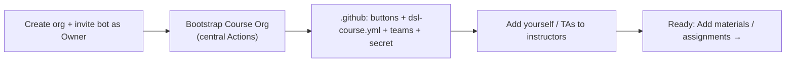

# New course org (one-time setup)

Stand up the **persistent** control plane for a course: its teams, the faculty console
(`.github` with all the buttons), and its identity card. Do this **once** per course - it
serves every future cohort (year). Per-year setup is [New cohort org](new-cohort-org.md).

## Prerequisites

- **`hertie-dsl-bot` is an Owner of the org you're about to bootstrap**. This is the one
  irreducible manual prerequisite (there is no org-creation API, and the bot needs Owner to
  create repos/teams and set the token). ([which account?](../admin/admin-setup.md#the-bot-account))
- **You are in the `faculty` (or `admin`) team of [`hertie-data-science-lab`](https://github.com/orgs/hertie-data-science-lab/teams)** -
  this gates the *Bootstrap Course Org* button. An org owner adds you (one-time; you accept an
  email invite). It does **not** "vary by year" - it's a standing credential.

## Steps

1. **Create the org** in the GitHub web UI. Naming convention: **`<course-name>-<CODE>`**
   (e.g. `DSL-Demo-Course-E1234`). The org is persistent, so the name carries **no year**.

2. **Invite `hertie-dsl-bot` as Owner** (Org → People → Invite → role *Owner*).

3. **Run [Bootstrap Course Org](https://github.com/hertie-data-science-lab/dsl-teaching-course-setup/actions/workflows/bootstrap-org.yml)** 
   (central DSL repo → Actions → *Run workflow*):

   | Input | Value | Notes |
   |-------|-------|-------|
   | `org` | the org you just made | e.g. `DSL-Demo-Course-E1234` |
   | `org_name` | display name | e.g. `DSL Demo Course` |
   | `course_code` | short code | e.g. `E1234` |
   | `set_secret` | `true` (default) | propagates `DSL_BOT_TOKEN` to the org - **don't set the secret by hand** |
   | `admin` | *your handle* | adds you to `course-admin` so you can run the course buttons (see step 5) |

   This creates everything below ([What it creates](#what-it-creates)) and is idempotent -
   safe to re-run.

4. **Confirm team membership in the course org.** Membership is **not** automatic. If you
   passed your handle as `admin` in step 3 you're already in `course-admin`. Otherwise an org
   owner adds you to **`instructors`** (write) or **`course-admin`** (admin) via the org's
   Teams page - either lets you run the course buttons. Add your TAs/co-instructors to
   `instructors` the same way.

5. *(optional)* **Adjust the identity card.** Bootstrap writes `.github/dsl-course.yml` from
   your inputs - usually nothing to change. It now holds **identity only**:

   ```yaml
   org: DSL-Demo-Course-E1234
   org_name: DSL Demo Course
   course_name: Deep Learning (Demo)   # site title
   course_code: E1234                  # site header
   ```

   > People (instructors/TAs) and the schedule are **not** here - they vary by year and live
   > in each [cohort's](new-cohort-org.md) `dsl-course.yml`.

   If you edit it (web UI → commit to `main`), run **Refresh actions** to rebuild the profile
   README; the cohort site picks up identity on its next *Sync site*. There is no dedicated
   "sync identity" button.

## What it creates

In the org's **`.github`** repo (public):

- **All faculty buttons** in the Actions tab (New materials/assignment, Refresh, Bootstrap
  cohort, Release, Sync, Grade, …) - seeded from the [central toolkit](https://github.com/hertie-data-science-lab/dsl-teaching-course-setup).
- **`dsl-course.yml`** - the identity card (above).
- **`README.md`** - an orientation page (you're reading the long-form version of it).
- **`profile/README.md`** - the org landing page (auto-generated; don't hand-edit).

Plus, org-wide: the **`instructors` / `course-admin` / `auditors` / `students` teams** (with
`instructors`→write, `course-admin`→admin on `.github`), **2FA enforcement**, and the
**`DSL_BOT_TOKEN`** org secret (scoped to `.github`).



## Next

- [Add materials](add-materials.md) and [Add assignment](add-assignment.md) to the course org.
- When the year starts: [New cohort org](new-cohort-org.md).

---
**Demo:** course org [`DSL-Demo-Course-E1234`](https://github.com/DSL-Demo-Course-E1234) ·
console [`.github` Actions](https://github.com/DSL-Demo-Course-E1234/.github/actions).
